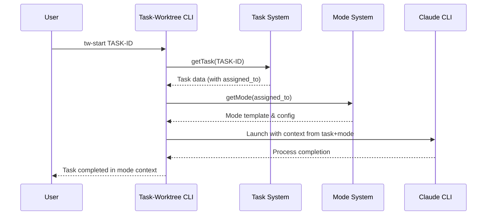
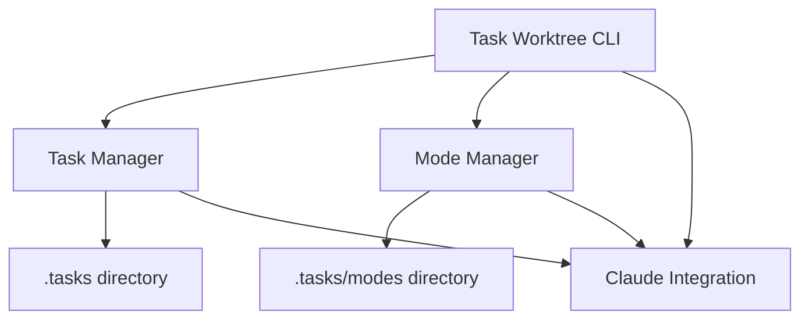

+++
id = "TASK-20250512T022821"
title = "Implement Mode-Based Task Orchestration System"
type = "🌟 Feature"
status = "🟡 To Do"
priority = "🔼 High"
created_date = "2025-05-12"
updated_date = "2025-05-12"
assigned_to = ""
subdirectory = "FEATURE_TaskOrchestration"
tags = [ "orchestration", "workflow", "task-delegation", "modes" ]
+++

# Implement Mode-Based Task Orchestration System

## Description ✍️

* **What is this feature?** A mode-based task orchestration system that extends the existing task-worktree functionality to support specialized roles/modes for different task types.

* **Why is it needed?** To enable more efficient and specialized task workflows, similar to RooCode's Orchestrator mode. This will allow tasks to be assigned to specific specialist modes with appropriate context and tooling, making complex workflows more manageable.

* **Scope:**
  - Extend the task-worktree system to support mode-based orchestration
  - Create a mode template structure and parser
  - Enhance the tw-start command to handle mode selection
  - Implement Claude command integration for mode-based contexts
  - Create documentation and examples for mode creation

* **Links:**
  - Related to workflow enhancement discussed in MDTM specs
  - Inspired by RooCode's Boomerang/Orchestrator mode

## Acceptance Criteria ✅

* - [ ] **Mode Discovery:** System can discover and parse mode templates from a designated directory (`.tasks/modes/` or `.modes/`)
* - [ ] **Mode Selection:** When starting a task, system reads the `assigned_to` field and locates the corresponding mode template
* - [ ] **Command Integration:** Enhanced `tw-start` command that supports launching Claude with mode-specific context
* - [ ] **Metadata Support:** Mode templates include metadata for Claude CLI configuration (allowed_tools, context_files)
* - [ ] **Default Fallback:** System gracefully handles missing mode templates with sensible defaults
* - [ ] **Documentation:** Comprehensive documentation on creating and using modes
* - [ ] **Example Modes:** At least 3 example mode templates (e.g., developer, reviewer, documenter)
* - [ ] **Tests:** Unit tests for mode discovery, parsing, and integration with task-worktree

## Implementation Notes / Sub-Tasks 📝

* - [ ] **Research & Design**
  * - [ ] Finalize mode template format and required fields
  * - [ ] Design directory structure for modes
  * - [ ] Document integration points with existing task-worktree system

* - [ ] **Core Implementation**
  * - [ ] Create mode discovery and parsing functionality
  * - [ ] Add mode loading to task-worktree.ts
  * - [ ] Enhance tw-start command to support mode context
  * - [ ] Implement Claude command generation with mode parameters

* - [ ] **Testing & Documentation**
  * - [ ] Write unit tests for mode functionality
  * - [ ] Create example mode templates
  * - [ ] Update documentation with mode usage instructions
  * - [ ] Create visual diagrams of the orchestration workflow

* - [ ] **Integration & Cleanup**
  * - [ ] Ensure backward compatibility with existing task workflows
  * - [ ] Add relevant command-line options for mode management
  * - [ ] Code cleanup and optimizations

## Diagrams 📊

## Architecture Overview

## AI Prompt Log 🤖

* Initial research on RooCode's Boomerang/Orchestrator mode
* Analysis of existing task-worktree implementation
* Design of mode-based orchestration system integrated with task-cli

## Review Notes 👀

* (Space for feedback during implementation)

