+++
id = "TASK-FEATUREPROPOSAL-0519-TX"
title = "Fix Path Parsing with Centralized PathUtils"
type = "prd"
status = "🟡 To Do"
priority = "▶️ Medium"
created_date = "2025-05-19"
updated_date = "2025-05-19"
assigned_to = ""
phase = "backlog"
subdirectory = "FEATURE_path-utils-fix"
tags = [ "proposal", "core", "path-management", "refactor" ]
depends_on = [ "CHORE-FIXPROJECTCONFIG-0520-BB" ]
+++

# Feature Specification: Fix Path Parsing with Centralized PathUtils [DRAFT]

## Overview
Path parsing logic in `projectConfig.parseTaskPath()` incorrectly extracts subdirectory values when using relative root paths (e.g., `./e2e_test/worktree-test`), causing phase filters to fail. This fix centralizes path operations in the existing directory-utils.ts with absolute path resolution internally while also simplifying the codebase by adopting dot-prefix for system directories and removing unnecessary path complexity.

## Visual Architecture Overview

### 1. File Resolution Flow - Current vs Proposed


### 2. Path Parsing Algorithm Flowchart

```mermaid
flowchart TD
    Start([Input: filePath]) --> Resolve[Resolve to absolute path]
    Resolve --> Check{Is under tasks directory?}
    Check -->|No| Return1[Return empty object]
    Check -->|Yes| Split[Split path into parts]
    Split --> Count{Count parts}
    Count -->|1| Return2[Return: no phase, no subdirectory]
    Count -->|2+| DotCheck{First part starts with '.'?}
    DotCheck -->|Yes| Return3[Return empty - system directory]
    DotCheck -->|No| Level{Part count?}
    Level -->|2| Return4[Return: phase=parts[0], no subdirectory]
    Level -->|3+| Return5[Return: phase=parts[0], subdirectory=parts[1:-1].join('/')]
```

### 3. Directory Structure Transformation

```mermaid
stateDiagram-v2
    [*] --> OldStructure: v0.10.0 Structure
    OldStructure --> Migration: migrateSystemDirectories()
    Migration --> NewStructure: Fixed Structure
    NewStructure --> [*]
    
    state OldStructure {
        tasks: .tasks/
        phases: .tasks/phases/ ❌
        config: .tasks/config/
        templates: .tasks/templates/
    }
    
    state Migration {
        step1: Remove phases concept
        step2: Rename config → .config
        step3: Rename templates → .templates
    }
    
    state NewStructure {
        root: .tasks/
        phase1: .tasks/test/ (phase)
        phase2: .tasks/prod/ (phase)
        config2: .tasks/.config/
        templates2: .tasks/.templates/
    }
```



### 4. Path Building Inside DirectoryUtils

```mermaid
flowchart LR
    subgraph Input
        ID[Task ID: TASK-001]
        Phase[Phase: test]
        SubDir[SubDir: feature]
    end
    
    subgraph DirectoryUtils
        GetTasksDir[getTasksDirectory()] --> Base[Base: /project/.tasks]
        Base --> CheckPhase{Has Phase?}
        CheckPhase -->|Yes| AddPhase[Add: /test]
        CheckPhase -->|No| SkipPhase[Skip]
        AddPhase --> CheckSubDir{Has SubDir?}
        SkipPhase --> CheckSubDir
        CheckSubDir -->|Yes| AddSubDir[Add: /feature]
        CheckSubDir -->|No| SkipSubDir[Skip]
        AddSubDir --> AddFile[Add: /TASK-001.md]
        SkipSubDir --> AddFile
    end
    
    subgraph Output
        Path[Full Path: /project/.tasks/test/feature/TASK-001.md]
    end
    
    AddFile --> Path
```

### 5. Component Architecture


### 6. Directory Structure Comparison


## Requirements

### Functional Requirements
1. Correctly parse task paths to extract phase and subdirectory regardless of root path format
2. Support both relative and absolute root paths (--root-dir parameter)
3. Migrate system directories to dot-prefix convention (.config, .templates)
4. Remove hardcoded special cases for system directories
5. Remove unnecessary phases directory concept - phases are just first-level directories
6. Maintain backward compatibility with automatic migration
7. Ensure phase filters work correctly with path variations

### Technical Requirements  
- Absolute path resolution for all internal path operations
- Consistent path parsing across all CRUD operations
- Automatic migration of existing config/templates to .config/.templates
- Remove unnecessary phases directory references
- No performance degradation for task listing
- Thread-safe path operations
- Proper handling of cross-platform path separators
- Comprehensive E2E testing without mocking

## Technical Design

### Root Cause Analysis
Two main issues exist in the current implementation:

1. **Path parsing bug**: The `projectConfig.parseTaskPath()` incorrectly calculates relative paths when using relative root directories
2. **Unnecessary complexity**: The introduction of a separate 'phases' directory concept that doesn't align with the actual directory structure

```typescript
// PROBLEM 1: Incorrect path resolution
parseTaskPath(filePath: string): { phase?: string; subdirectory?: string } {
  const tasksRoot = this.paths.tasksRoot;
  // When tasksRoot is relative and filePath is absolute, path.relative fails
  const relativePath = path.relative(absoluteTasksRoot, absoluteFilePath);
}

// PROBLEM 2: Unnecessary phases directory
const DEFAULT_DIRECTORIES = {
  tasks: '.tasks',
  phases: '.tasks/phases',  // This was mistakenly added
  config: '.tasks/config',
  templates: '.tasks/templates',
};
```

### Correct Directory Structure
Based on v0.9.0 analysis, the proper structure is:
```
.tasks/
├── test/              # This IS a phase (level 1)
│   ├── TASK-001.md    # Task in phase
│   └── feature/       # This is a subdirectory (level 2)
│       └── TASK-002.md
├── production/        # Another phase
├── .config/           # System directory (after migration)
├── .templates/        # System directory (after migration)
└── TASK-ROOT.md       # Task at root (no phase)
```

### Components Affected
- **ProjectConfig** (`src/core/project-config.ts`): 
  - Remove phasesRoot concept entirely
  - Update DEFAULT_DIRECTORIES to use .config and .templates
  - Remove systemDirs special handling
  - Simplify parseTaskPath logic
- **directory-utils** (`src/core/task-manager/directory-utils.ts`):
  - New methods: `parseTaskPath()`, `getTaskFilePath()`, `resolveAbsolutePath()`
  - Add migration helper: `migrateSystemDirectories()`
- **task-crud** and related files: Update imports and remove phase directory references

### Implementation Approach

1. **Update default directory structure**:
```typescript
// In project-config.ts - REMOVE phases directory
const DEFAULT_DIRECTORIES = {
  tasks: '.tasks',
  config: '.tasks/.config',    // Changed from 'config'
  templates: '.tasks/.templates', // Changed from 'templates'
  // NO phases directory - phases are just first-level dirs under tasks
};
```

2. **Enhance directory-utils.ts with simplified path logic**:
```typescript
export function parseTaskPath(filePath: string, config?: RuntimeConfig): { phase?: string; subdirectory?: string } {
  const tasksDir = getTasksDirectory(config);
  const absoluteTasksDir = path.resolve(tasksDir);
  const absoluteFilePath = path.resolve(filePath);
  
  // Ensure file is under tasks directory
  if (!absoluteFilePath.startsWith(absoluteTasksDir)) {
    return {};
  }
  
  const relativePath = path.relative(absoluteTasksDir, absoluteFilePath);
  const parts = relativePath.split(path.sep);
  
  // Use the v0.9.0 logic - clean and simple
  if (parts.length === 1) {
    // Only filename, no phase or subdirectory
    return {};
  }
  
  // Skip dot-prefix directories (system dirs)
  if (parts[0].startsWith('.')) {
    return {};
  }
  
  if (parts.length === 2) {
    // phase/filename - has phase but no subdirectory
    return { phase: parts[0] };
  }
  
  // Has both phase and subdirectory (or more levels)
  const phase = parts[0];
  // Combine all middle directories as the subdirectory path
  const subdirectory = parts.slice(1, -1).join(path.sep);
  return { phase, subdirectory };
}
```

3. **Migration function for system directories**:
```typescript
export function migrateSystemDirectories(config?: RuntimeConfig): void {
  const tasksDir = getTasksDirectory(config);
  
  // Migrate config and templates to dot-prefix
  const migrations = [
    { old: 'config', new: '.config' },
    { old: 'templates', new: '.templates' }
  ];
  
  for (const { old, new: newName } of migrations) {
    const oldPath = path.join(tasksDir, old);
    const newPath = path.join(tasksDir, newName);
    
    if (fs.existsSync(oldPath) && !fs.existsSync(newPath)) {
      fs.renameSync(oldPath, newPath);
    }
  }
}
```

## Implementation Notes

### Critical Changes
- Remove all references to phasesRoot throughout the codebase
- Phases are simply first-level directories under .tasks (excluding dot-prefixed)
- Subdirectories can be nested to any depth
- System directories use dot-prefix for clean separation

### Migration Strategy
1. Automatically migrate system directories on startup
2. Remove phases directory references from all code
3. Update all path calculations to use simplified logic
4. Ensure backward compatibility during transition

## Testing Approach

### E2E Tests for directory-utils.ts
**CRITICAL: No mocking of file operations - real filesystem tests only**

```typescript
// test/e2e/directory-utils.e2e.test.ts
describe('directory-utils E2E Tests', () => {
  describe('parseTaskPath with real directory structure', () => {
    it('correctly identifies phases as first-level directories', () => {
      // Create structure:
      // .tasks/
      //   test/
      //     TASK-001.md
      //   production/
      //     feature/
      //       TASK-002.md
      
      const testTask = path.join(testEnv.tasksDir, 'test', 'TASK-001.md');
      const result = parseTaskPath(testTask);
      
      expect(result.phase).toBe('test');
      expect(result.subdirectory).toBeUndefined();
    });
    
    it('correctly identifies subdirectories at level 2+', () => {
      const featureTask = path.join(testEnv.tasksDir, 'production', 'feature', 'TASK-002.md');
      const result = parseTaskPath(featureTask);
      
      expect(result.phase).toBe('production');
      expect(result.subdirectory).toBe('feature');
    });
    
    it('handles nested subdirectories correctly', () => {
      const nestedTask = path.join(testEnv.tasksDir, 'dev', 'feature', 'auth', 'TASK-003.md');
      const result = parseTaskPath(nestedTask);
      
      expect(result.phase).toBe('dev');
      expect(result.subdirectory).toBe('feature/auth');
    });
    
    it('skips dot-prefixed directories', () => {
      const configFile = path.join(testEnv.tasksDir, '.config', 'test.toml');
      const result = parseTaskPath(configFile);
      
      expect(result.phase).toBeUndefined();
      expect(result.subdirectory).toBeUndefined();
    });
  });
});
```

### Unit Tests
- Test the three-level path logic (root, phase, subdirectory)
- Verify dot-prefix directory skipping
- Test cross-platform path handling
- Validate migration scenarios

### Integration Tests
- Ensure existing tests pass with simplified structure
- Verify phase filters work correctly
- Test task CRUD operations
- Confirm templates and config access after migration

## Task Breakdown Preview

### Core Tasks
1. **Remove phases directory concept** (Critical Priority)
   - Remove phasesRoot from ProjectConfig
   - Update all references throughout codebase
   - Simplify directory structure constants
   
2. **Enhance directory-utils.ts** (High Priority)
   - Implement v0.9.0-style parseTaskPath logic
   - Add absolute path resolution
   - Implement system directory migration
   
3. **Update ProjectConfig** (High Priority)
   - Remove phases directory logic
   - Delegate path operations to directory-utils
   - Add migration initialization
   
4. **Update all path references** (Medium Priority)
   - Task CRUD operations
   - Feature/Area CRUD operations
   - Template manager
   - Phase management logic

### Testing Tasks
5. **Create comprehensive E2E tests** (Critical Priority)
   - Real filesystem operations
   - Test three-level path structure
   - Migration scenarios
   - Cross-platform compatibility
   
6. **Update existing tests** (High Priority)
   - Remove phases directory assumptions
   - Update fixtures to new structure
   - Verify all tests pass

### Documentation Tasks
7. **Update documentation** (Low Priority)
   - Clarify phase = first-level directory
   - Document migration process
   - Update examples

## Human Review Required

### Technical decisions needing verification:
- [ ] Removal of phases directory concept is correct
- [ ] Three-level path logic matches v0.9.0 behavior
- [ ] Dot-prefix convention for system directories
- [ ] Migration timing and strategy

### Design decisions to confirm:
- [ ] Backward compatibility approach
- [ ] Error handling for edge cases
- [ ] Performance impact of changes
- [ ] Test coverage adequacy

### Implementation concerns:
- [ ] All phases directory references identified
- [ ] Migration is safe and idempotent
- [ ] Path logic handles all edge cases
- [ ] Security implications reviewed
