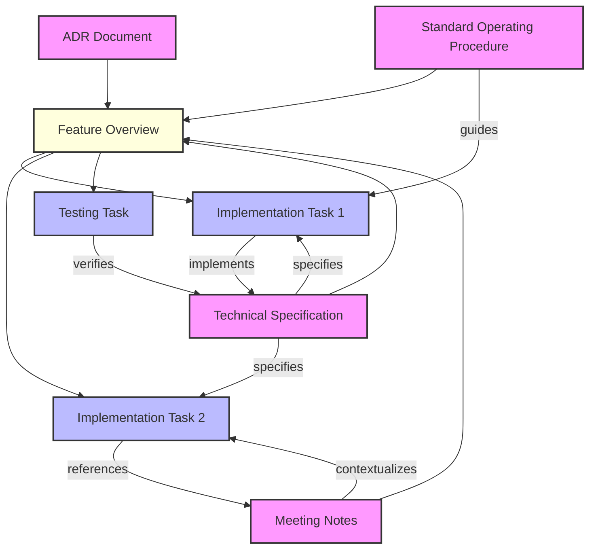
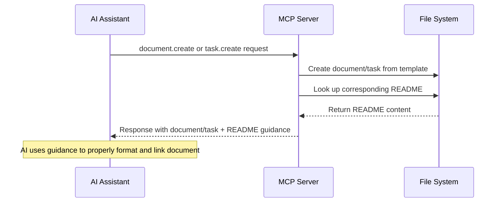

+++
id = "TASK-20250516T014609"
title = "Document Support Brainstorming"
type = "feature"
status = "🟡 To Do"
priority = "▶️ Medium"
created_date = "2025-05-16"
updated_date = "2025-05-16"
assigned_to = ""
tags = [ "brainstorming", "planning", "document-support" ]
phase = "backlog"
subdirectory = ""
+++

# Document Support Brainstorming

## 1. Overview / Purpose 🎯

* Extend the MDTM system to fully support various document types (ADRs, SOPs, meeting notes, etc.) with the same level of structure, organization, and discoverability as tasks
* Create a unified knowledge management system where both actionable tasks and supporting documentation are integrated through consistent interfaces
* Enable AI-driven workflows for document creation, maintenance, and relationship management with tasks
* Provide bidirectional traceability between tasks and the documents that inform, specify, or document them

## 2. Problem Statement 🤔

* The current system focuses primarily on task management, filtering for task templates (01-06) during initialization while document templates (07+) exist but aren't fully integrated
* There's no standardized way to manage document-task relationships, making it difficult to maintain bidirectional traceability
* Teams struggle with the "what goes where" problem - unclear boundaries between what belongs in tasks vs. documents
* Changes to documents don't automatically trigger awareness of potentially impacted tasks, and vice versa
* AI assistants lack structured guidance on document creation, linking, and maintenance in the context of related tasks
* The current relationship model doesn't fully capture the various types of relationships between documents and tasks

## 3. Proposed Solution ✨

### A. Full Document Type Integration

* Extend template-manager.ts to fully support document templates with consistent initialization
* Implement document CRUD operations parallel to the existing task operations
* Create MCP commands specific to document management (document.list, document.create, etc.)
* Add document type categorization to distinguish different document purposes

### B. Bidirectional Relationship Management

* Implement a relationship tracking system that maintains bidirectional links between documents and tasks
* Define relationship types (implements, specifies, describes, depends-on, etc.) to clarify how items relate
* Ensure relationships remain consistent when either linked item is modified
* Provide tools to visualize and navigate relationships

### C. README-Driven AI Guidance

* Enhance the template README system to include detailed AI guidance for each document type
* For the initial implementation, have the MCP server automatically return the corresponding README content whenever document.create or task.create is called
* This provides immediate context to the AI about how to properly structure and link the document/task
* No changes to clients needed as the guidance is included in the standard response
* Pair each document template with a README that outlines:
  * Purpose and appropriate usage of the document type
  * Expected relationship patterns with tasks and other documents
  * Guidance on content structuring and maintenance
  * Instructions for AI on when/how to update related items

### D. Context-Building Tools

* Create tools specifically designed for AI context gathering across related documents and tasks
* Implement relationship traversal capabilities to build comprehensive context
* Provide discoverability features to identify relevant documents/tasks

## 4. Goals ✅

* Support all document templates with full lifecycle operations through both CLI and MCP interfaces
* Implement bidirectional relationship tracking with defined relationship types
* Provide MCP commands for document management and relationship queries that match the quality of task commands
* Enable README-driven customization and guidance for document types per project
* Create visualization tools for document-task relationship networks
* Improve context building for AI through relationship traversal capabilities
* Achieve 100% template coverage (all templates 01-18+ supported equally)

## 5. Non-Goals ❌

* Building a full wiki system or complex document management system like Confluence
* Implementing real-time collaboration features on documents
* Creating a permission/access control system for documents
* Replacing existing documentation platforms - this extends MDTM, not replaces external systems
* Building document versioning beyond what git provides
* Automatic synchronization with external documentation systems

## 6. Technical Design / Implementation Sketch 🛠️

### Template Manager Extensions

* Modify listTemplates() to categorize between tasks and documents
* Add document-specific template operations
* Update initializeTemplates() to optionally include document templates

### Core Data Model Enhancements

* Add relationship tracking fields to both task and document metadata
* Implement relationship type enumerations
* Create bidirectional link maintenance logic

### MCP Command Layer

* Add document-specific commands parallel to task commands:
  * document.list - List available documents with filtering
  * document.get - Get document content and metadata
  * document.create - Create document from template
  * document.update - Update document content or metadata
* Add relationship management commands:
  * relationship.list - List relationships for a document/task
  * relationship.create - Create relationship between items
  * relationship.delete - Remove relationship
* Add context building commands:
  * context.build - Gather content from related items

### README Guidance Implementation

* Implement an enhancement to task.create and document.create handlers to:
  1. Execute the normal creation logic
  2. Look up the corresponding README file for the template used
  3. Include the README content in a new 'guidance' field in the response
  4. Structure the response to maintain backward compatibility
* This simple approach provides immediate AI guidance without requiring client changes
* Later iterations can enhance this with more sophisticated guidance mechanisms

### Storage and Organization

* Extend directory structure to accommodate document organization
* Implement relationship indexing for quick lookups

## 7. Alternatives Considered 🔄

* **Separate Document System:** Considered building a completely separate document management component, but rejected due to integration challenges and duplication of functionality
* **External Wiki Integration:** Evaluated using external wiki tools with simple linking, but rejected due to consistency challenges and synchronization issues
* **Complex Metadata System:** Explored using elaborate metadata for document categorization, but favored the simpler relationship-based approach for flexibility and maintainability
* **Embedding Documents in Tasks:** Considered embedding document content within tasks, but rejected as it would limit document reuse and create maintenance challenges
* **Separate Guidance API:** Considered building a dedicated API for template guidance, but the simpler approach of including README content in create responses is more backward compatible

## 8. Open Questions / Risks ❓

* How will relationship consistency be maintained when files are renamed or moved?
* What's the best way to represent and visualize complex multi-item relationship networks?
* How should relationship types be extended or customized per project?
* What performance considerations exist for large document/task collections with many relationships?
* How will backward compatibility be maintained with existing task structures?
* What's the right balance between automation and manual curation of relationships?
* How should README guidance be versioned if the template evolves?

## 9. Diagrams / Visuals 📊

## README Guidance Flow

## 10. Related Links 🔗

* [MDTM Directory Structure](/docs/mdtm-directory-structure.md) - Current directory structure implementation
* [MDTM Standard](/docs/specs/mdtm_standard.md) - Base standard this builds upon
* [Feature Proposal README](/docs/templates/17_feature_proposal.README.md) - Example of README-driven template guidance
