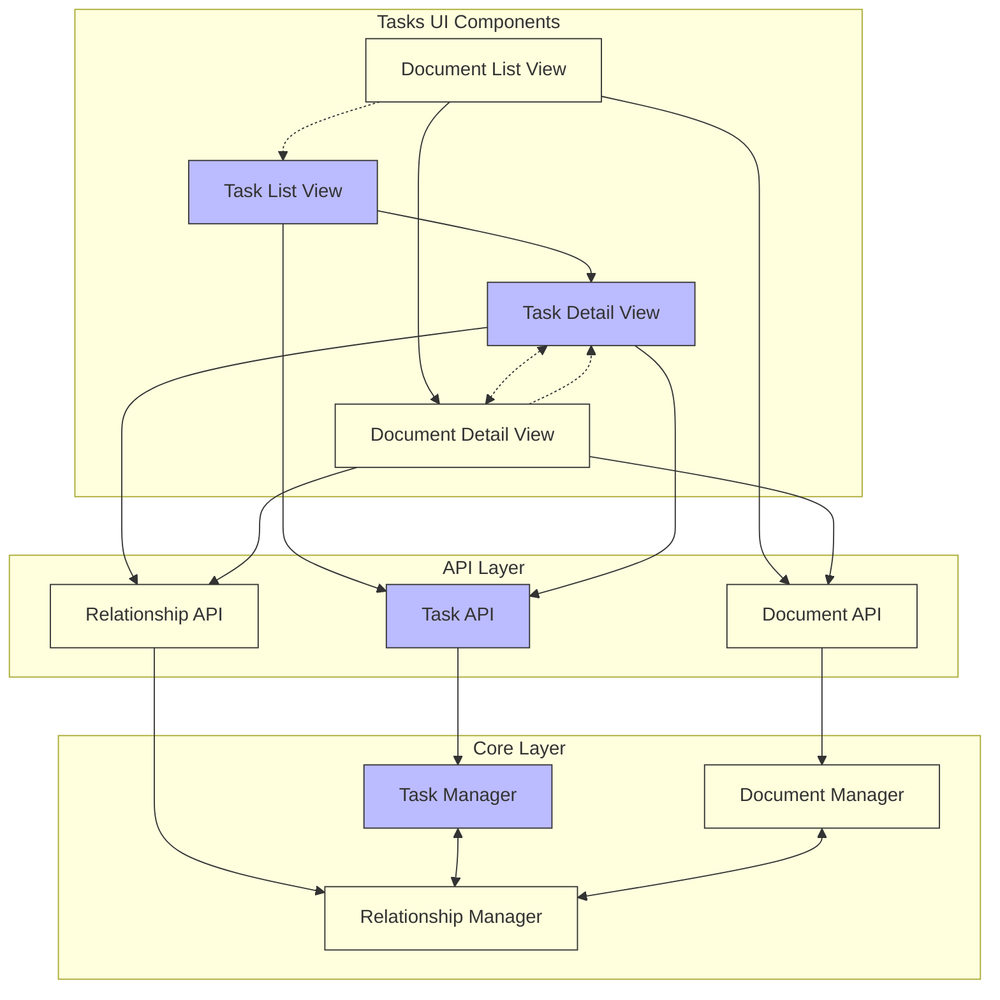

+++
id = "TASK-FEATUREPROPOSAL-0520-3F"
title = "Feature Proposal: Document Viewer for Tasks UI"
type = "proposal"
status = "🟡 To Do"
priority = "▶️ Medium"
created_date = "2025-05-20"
updated_date = "2025-05-20"
assigned_to = ""
phase = "backlog"
tags = [ "ui", "documentation", "viewer", "feature" ]
related_tasks = [ "TASK-20250516T014609" ]
+++

# Document Viewer for Tasks UI

## 1. Overview / Purpose 🎯

* Extend the Tasks UI with a dedicated document viewer that mirrors the task viewing experience
* Provide a unified interface for browsing and viewing all document types within the MDTM system
* Support various document types (ADRs, SOPs, meeting notes, feature proposals, etc.) with appropriate rendering and formatting
* Enable easy navigation between related documents and tasks
* Create a foundation for future document editing capabilities

## 2. Problem Statement 🤔

* The current Tasks UI focuses exclusively on task management without support for viewing other document types
* Users need to switch between the Tasks UI and other tools/editors to view documents related to their tasks
* There's no consistent way to view and navigate documentation within the same interface
* Markdown rendering capabilities already exist for task content but aren't available for standalone documentation
* The system has a growing collection of document templates (ADRs, SOPs, feature proposals, etc.) without a dedicated viewing interface

## 3. Proposed Solution ✨

### A. Document Browser Component

* Create a new sidebar section for document categories and types
* Implement a document listing view similar to the task list
* Support filtering by document type, related features/areas, and metadata
* Provide sorting options for document discovery

### B. Document Viewer Component

* Build a specialized viewer for different document types, leveraging the existing task content rendering
* Support rich Markdown rendering including:
  * Mermaid diagrams
  * Code syntax highlighting
  * Tables
  * Images and other media
* Implement a responsive layout that adapts to document content

### C. Document-Task Relationship Display

* Show related tasks for each document
* Visualize bidirectional relationships between documents and tasks
* Provide navigation links to move between related items
* Display relationship types (implements, specifies, references, etc.)

### D. Metadata Panel

* Display document metadata in a structured format
* Show document history and evolution
* Include links to related documents based on metadata relationships

## 4. Goals ✅

* Provide a unified viewing experience for all MDTM document types
* Maintain UI consistency with the existing task management interface
* Support all Markdown features currently available in task content viewing
* Enable easy navigation between documents and related tasks
* Create a foundation for future document editing capabilities
* Improve document discoverability and organization

## 5. Non-Goals ❌

* Building a full document editing interface in the initial version (view-only initially)
* Replacing external documentation tools like Confluence or Notion
* Supporting non-Markdown document formats
* Implementing advanced document collaboration features
* Creating complex document approval workflows
* Building a custom search engine for document content

## 6. Technical Design / Implementation Sketch 🛠️

### React Component Structure

```
src/
  components/
    document-browser/
      DocumentBrowserView.tsx       # Main document list container
      DocumentTypeSelector.tsx      # Document type filter component
      DocumentListTable.tsx         # Table display of documents
    document-detail/
      DocumentDetailView.tsx        # Main document viewer container
      DocumentContent.tsx           # Markdown rendering component
      DocumentMetadata.tsx          # Metadata display panel
      DocumentRelationships.tsx     # Related items visualization
```

### API Integration

* Extend core-client.ts to support document API endpoints:
  ```typescript
  // New methods to add
  listDocuments(filters?: DocumentFilters): Promise<OperationResult<Document[]>>
  getDocument(id: string): Promise<OperationResult<Document>>
  getDocumentRelationships(id: string): Promise<OperationResult<Relationship[]>>
  ```

* Add RESTful API endpoints in server.ts:
  ```typescript
  // New endpoints to add
  GET /api/documents - List documents with filtering
  GET /api/documents/:id - Get document content and metadata
  GET /api/documents/:id/relationships - Get document relationships
  ```

### Routing Integration

* Add new routes to the application:
  ```typescript
  // In routes.ts
  const DOCUMENT_ROUTES = {
    LIST: '/documents',
    DETAIL: '/documents/:id'
  }
  ```

### State Management

* Create a DocumentContext provider for document-specific state:
  ```typescript
  // Create a new context
  const DocumentContext = createContext<DocumentContextValue | undefined>(undefined);
  
  // Provider implementation
  export function DocumentProvider({ children }: { children: React.ReactNode }) {
    // State and methods for document management
    
    return (
      <DocumentContext.Provider value={value}>
        {children}
      </DocumentContext.Provider>
    );
  }
  ```

## 7. User Experience

### Document Browser

* The document browser will appear as a new section in the sidebar
* Users can browse documents by type, category, or relationship to features/areas
* The list view will show document titles, types, and last modified dates
* Filtering controls will allow narrowing down the document list

### Document Detail View

* Clicking a document in the list opens its detail view
* The detail view includes:
  * Document title and metadata header
  * Full rendered Markdown content
  * Side panel showing metadata and relationships
  * Navigation links to related tasks and documents

### Navigation Flow

* Users can navigate between tasks and documents through relationship links
* The breadcrumb trail shows the navigation path
* Back/forward navigation maintains context between task and document views

## 8. Alternatives Considered 🔄

* **Embedding Document Viewer in Task Detail:** Considered showing documents inline within task details, but this would limit the viewing experience and create UI crowding
* **External Document Link Approach:** Evaluated simply linking to documents to open in separate apps/tabs, but this breaks the integrated experience
* **iframe-based Document Preview:** Explored using iframes to embed document previews, but this limits integration capabilities and creates styling challenges
* **Custom Document Format:** Considered a specialized document format, but Markdown consistency is preferable for maintainability

## 9. Open Questions / Risks ❓

* How will performance be affected when rendering large documents with complex Markdown (diagrams, tables, etc.)?
* What's the best way to handle document versioning in the UI?
* How should relationships between documents and tasks be visualized most effectively?
* What's the right balance of information density vs. readability in the document listing?
* How should we handle documents with missing or incomplete metadata?
* What access control considerations exist for document viewing?

## 10. Implementation Phases

### Phase 1: Core Document Viewing

* Document browser component with basic filtering
* Document detail view with Markdown rendering
* API integration for document retrieval
* Routing setup for document navigation

### Phase 2: Relationship Display

* Document-task relationship visualization
* Related document linking
* Navigation between related items
* Relationship type indicators

### Phase 3: Enhanced Features

* Mermaid diagram rendering
* Advanced filtering and sorting
* Metadata panel enhancements
* Document history display

## 11. Diagrams / Visuals 📊



## Mock UI Design

Document Browser:
```
+----------------------------------------+
| ◀ Documents                            |
+----------------------------------------+
| Type: ▼ All Types                      |
| Area: ▼ All Areas                      |
+----------------------------------------+
| Title               | Type    | Date   |
+----------------------------------------+
| Feature Proposal:   | Proposal| May 20 |
| Document Viewer     |         |        |
+----------------------------------------+
| Architecture        | ADR     | May 19 |
| Decision: Logging   |         |        |
+----------------------------------------+
| Meeting Notes:      | Meeting | May 18 |
| Sprint Planning     |         |        |
+----------------------------------------+
```

Document Detail View:
```
+--------------------------------------+---------------+
| Document Viewer Feature Proposal     | Metadata      |
+--------------------------------------+---------------+
|                                      | Status: Draft |
| # Document Viewer for Tasks UI       | Created: 5/20 |
|                                      | Type: Proposal|
| ## 1. Overview / Purpose 🎯         | Tags: UI, Docs|
|                                      |               |
| * Extend the Tasks UI with a         | Relationships |
|   dedicated document viewer...       |               |
| * Provide a unified interface...     | → Task #123   |
|                                      | → ADR #42     |
| ## 2. Problem Statement 🤔          |               |
|                                      |               |
| [Content continues...]               |               |
+--------------------------------------+---------------+
```

## 12. Related Links 🔗

* [Document Support Brainstorming](/tasks-view?id=TASK-20250516T014609) - Related brainstorming task
* [System Architecture](/docs/system-architecture.md) - Overall system design document
* [Tasks UI README](/tasks-ui/README.md) - Tasks UI documentation
