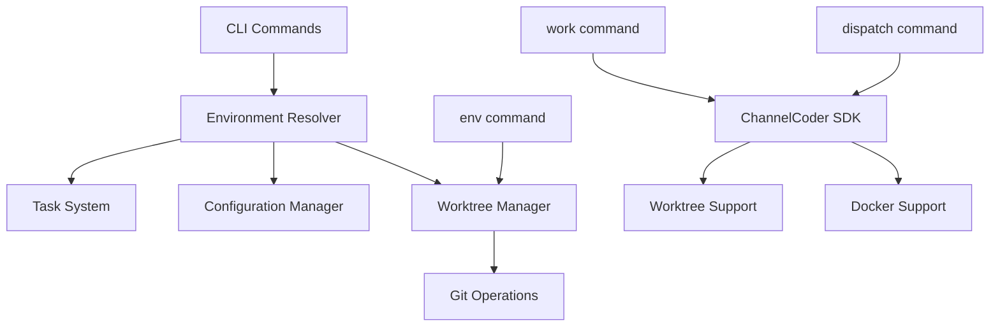

# Technical Requirements Document: CLI Commands Implementation

## Executive Summary

This document defines the technical architecture and implementation approach for three new CLI commands (`env`, `work`, `dispatch`) that will replace existing prototype scripts. The implementation leverages existing patterns in the Scopecraft CLI while integrating with ChannelCoder SDK's native worktree and Docker capabilities.

**Architecture Alignment**: This MVP implementation is designed to align with Scopecraft's long-term service architecture vision, placing domain logic in core services rather than CLI utilities, and maintaining clear boundaries between system components.

## Architecture Overview

### Module Structure

**Note**: This MVP structure will evolve toward the full service architecture, but maintains compatibility with that vision.

```
src/
├── cli/
│   ├── cli.ts                    # Main entry (existing)
│   ├── entity-commands.ts        # Command registration (existing)
│   └── commands/
│       ├── env-commands.ts       # NEW: Environment command handlers
│       ├── work-commands.ts      # NEW: Work command handlers
│       └── dispatch-commands.ts  # NEW: Dispatch command handlers
├── core/
│   ├── environment/              # NEW: Core environment logic
│   │   ├── index.ts
│   │   ├── types.ts
│   │   ├── worktree-manager.ts   # Will become environment-service
│   │   └── resolver.ts           # Environment resolution logic
│   └── services/                 # Future service location
│       └── README.md             # Reserve for future migration
└── integrations/
    └── channelcoder/             # NEW: ChannelCoder SDK wrapper
        ├── index.ts
        ├── types.ts
        └── session-adapter.ts    # Adapts to future session-service
```

**Key Design Decisions for Future Compatibility:**
- Environment logic in `core/` not `cli/utils/` (core is pure domain)
- ChannelCoder wrapped in integration layer (easy to swap later)
- Command handlers stay thin (just adapt CLI to core)
- Path/config services in core, not scattered in CLI

### Integration Points



## Core Interfaces

### Environment Management

```typescript
// src/core/environment/types.ts
export interface EnvironmentResolver {
  /**
   * Resolves the environment ID for a task
   * - For parent tasks: returns the task ID
   * - For subtasks: returns the parent ID
   */
  resolveEnvironmentId(taskId: string): Promise<string>;
  
  /**
   * Ensures environment exists (creates if missing)
   * @returns Environment info including path
   */
  ensureEnvironment(envId: string): Promise<EnvironmentInfo>;
  
  /**
   * Gets environment info without creating
   */
  getEnvironmentInfo(envId: string): Promise<EnvironmentInfo | null>;
}

export interface EnvironmentInfo {
  id: string;
  path: string;
  branch: string;
  exists: boolean;
  isActive: boolean;
}

export interface WorktreeManager {
  create(taskId: string, options?: WorktreeOptions): Promise<WorktreeInfo>;
  remove(taskId: string): Promise<void>;
  list(): Promise<WorktreeInfo[]>;
  getPath(taskId: string): string;
  // Path resolution should be internal - don't expose implementation details
}

export interface WorktreeOptions {
  base?: string;  // Base branch (default: current branch)
  force?: boolean; // Force creation even if exists
}

export interface WorktreeInfo {
  path: string;
  branch: string;
  taskId: string;
  commit: string;
}
```

### Command Handlers

```typescript
// src/cli/commands/env-commands.ts
export interface EnvCommandOptions {
  rootDir?: string;  // From global options
}

export interface EnvSubcommands {
  // sc env <taskId> - Create/enter environment
  create(taskId: string, options: EnvCommandOptions): Promise<void>;
  
  // sc env close <taskId> - Close and cleanup
  close(taskId: string, options: EnvCommandOptions): Promise<void>;
  
  // sc env list - List active environments
  list(options: EnvCommandOptions): Promise<void>;
  
  // sc env path <taskId> - Output path for shell
  path(taskId: string, options: EnvCommandOptions): Promise<void>;
}

// src/cli/commands/work-commands.ts
export interface WorkCommandOptions extends EnvCommandOptions {
  mode?: WorkMode;
  noDocker?: boolean;
}

export type WorkMode = 'implement' | 'explore' | 'orchestrate' | 'diagnose';

// src/cli/commands/dispatch-commands.ts
export interface DispatchCommandOptions extends EnvCommandOptions {
  mode?: WorkMode;
  exec?: 'docker' | 'detached';
}
```

### ChannelCoder Integration

```typescript
// src/integrations/channelcoder/types.ts
export interface ChannelCoderClient {
  /**
   * Execute Claude in interactive mode with worktree
   * Note: We use ChannelCoder's worktree support for Claude execution,
   * but manage worktrees directly for env command operations
   */
  executeInteractive(options: InteractiveOptions): Promise<void>;
  
  /**
   * Execute Claude in Docker mode
   */
  executeDocker(options: DockerOptions): Promise<void>;
}

export interface InteractiveOptions {
  prompt: string;
  worktree: {
    branch: string;
    path: string;
    create: boolean;
  };
  mode?: WorkMode;
  additionalPrompt?: string;
}

export interface DockerOptions extends InteractiveOptions {
  docker: {
    image: string;
    mounts?: string[];
    env?: Record<string, string>;
  };
}
```

## Dependencies

### Required NPM Packages

```json
{
  "dependencies": {
    "@inquirer/prompts": "^5.0.0",    // Interactive task selection
    "channelcoder": "^1.0.0",          // ChannelCoder SDK (exact version TBD)
    "commander": "^12.0.0",            // Existing CLI framework
    "simple-git": "^3.22.0",           // Git operations for worktree management
    "zod": "^3.22.0"                   // Runtime validation for command inputs
  }
}
```

### Dependency Rationale

1. **@inquirer/prompts**: Modern, modular prompts library
   - Lighter than full inquirer package
   - Better TypeScript support
   - Used only for task selection in `work` command

2. **channelcoder**: Core SDK for Claude integration
   - Provides native worktree support
   - Handles Docker execution
   - Manages session streaming

3. **simple-git**: Programmatic git operations
   - While ChannelCoder has worktree support, we need direct git access for:
     - `env` command operations (list, close, cleanup)
     - Custom worktree naming patterns
     - Branch status checks before closing
     - More granular control over git operations
   - More reliable than shell commands
   - Better error handling

4. **commander**: Already in use, no change needed

5. **zod**: Runtime validation
   - Type-safe validation for command inputs
   - Better error messages for users
   - Consistent with existing Scopecraft patterns

## Implementation Guidelines

### Worktree Path Resolution

The system must work for ANY project, not just Scopecraft. **Critical: Centralize path resolution logic**:

```typescript
// src/core/environment/worktree-path-resolver.ts
// GOOD: Domain logic in core, not in CLI utils
export class WorktreePathResolver {
  constructor(private config: ConfigurationManager) {}
  
  async getWorktreeBasePath(): Promise<string> {
    const projectRoot = await this.config.getProjectRoot();
    const projectName = path.basename(projectRoot).toLowerCase();
    // This is the ONLY place this pattern should exist
    return path.resolve(path.dirname(projectRoot), `${projectName}.worktrees`);
  }
  
  async getWorktreePath(taskId: string): Promise<string> {
    const basePath = await this.getWorktreeBasePath();
    return path.join(basePath, taskId);
  }
}

// BAD: Don't hardcode paths in multiple places
// ❌ const worktreePath = `../${projectName}.worktrees/${taskId}`;
// ❌ const base = path.join('..', projectName + '.worktrees');
// ✅ const worktreePath = await pathResolver.getWorktreePath(taskId);
```

**Key Design Principles:**
- Path resolution logic must be isolated in a single service/class
- No magic strings or patterns scattered through the codebase
- Easy to make configurable later (just update one class)
- All components use the centralized resolver

**Examples:**
- Project: /Users/alice/projects/scopecraft → ../scopecraft.worktrees/
- Project: /Users/bob/work/client-app → ../client-app.worktrees/
- Project: /home/team/awesome-tool → ../awesome-tool.worktrees/

### Other Configurable Values

Following the same principle, these values should also be centralized:

```typescript
// Branch naming convention
export class BranchNamingService {
  getBranchName(taskId: string): string {
    // Centralized branch naming pattern
    return `task/${taskId}`;  // This pattern should exist in ONE place
  }
  
  getDefaultBaseBranch(): string {
    // Could later read from config, git default, etc.
    return 'main';
  }
}

// Docker configuration
export class DockerConfigService {
  getDefaultImage(): string {
    // Centralized Docker image configuration
    return 'my-claude:authenticated';
  }
  
  getWorkspaceMountPath(): string {
    return '/workspace';  // Docker workspace path
  }
}

// Mode defaults
export class ModeDefaultsService {
  inferMode(task: Task): WorkMode {
    // Centralized mode inference logic
    if (task.taskStructure === 'parent') return 'orchestrate';
    
    const modeMap: Record<TaskType, WorkMode> = {
      'bug': 'diagnose',
      'spike': 'explore',
      'feature': 'implement',
      'chore': 'implement',
      // etc.
    };
    
    return modeMap[task.type] || 'implement';
  }
}
```

**Key Principle**: Any value that might become configurable should be:
1. Defined in exactly ONE place
2. Accessed through a service/function
3. Never hardcoded inline in business logic
4. Easy to replace with config lookup later

### Input Validation with Zod

Use Zod schemas for all command inputs:

```typescript
// src/cli/schemas/work-command.schemas.ts
import { z } from 'zod';

export const WorkModeSchema = z.enum(['implement', 'explore', 'orchestrate', 'diagnose']);

export const WorkCommandOptionsSchema = z.object({
  mode: WorkModeSchema.optional(),
  noDocker: z.boolean().optional(),
  rootDir: z.string().optional(),
});

export const WorkCommandArgsSchema = z.object({
  taskId: z.string().optional(),
  additionalPrompt: z.array(z.string()).optional(),
});

// Usage in command handler
export async function handleWorkCommand(
  taskId: string | undefined,
  additionalPromptArgs: string[],
  options: any
): Promise<void> {
  // Validate inputs
  const validatedOptions = WorkCommandOptionsSchema.parse(options);
  const validatedArgs = WorkCommandArgsSchema.parse({
    taskId,
    additionalPrompt: additionalPromptArgs,
  });
  
  // Now we have type-safe, validated inputs
  // ...
}
```

**Validation Principles:**
- Define schemas near their usage (co-locate)
- Provide helpful error messages
- Validate early in command handlers
- Use `.parse()` for throwing errors, `.safeParse()` for handling

### Command Registration Pattern

Follow existing pattern in `entity-commands.ts`:

```typescript
// src/cli/entity-commands.ts
export function setupEnvironmentCommands(program: Command): void {
  const envCommand = program
    .command('env')
    .description('Manage development environments (worktrees)');
    
  // Subcommands follow existing patterns
  envCommand
    .command('close')
    .description('Close environment and merge changes')
    .argument('<taskId>', 'Task ID')
    .action(handleEnvCloseCommand);
    
  // Default action for "sc env <taskId>"
  envCommand
    .argument('<taskId>', 'Task ID')
    .action(handleEnvCreateCommand);
}

export function setupWorkCommands(program: Command): void {
  program
    .command('work')
    .alias('w')  // Short alias
    .description('Start interactive Claude session')
    .argument('[taskId]', 'Task ID (optional)')
    .argument('[additionalPrompt...]', 'Additional context')
    .option('-m, --mode <mode>', 'Override work mode')
    .option('--no-docker', 'Force interactive mode')
    .action(handleWorkCommand);
}
```

### Error Handling Strategy

```typescript
// Consistent with existing error patterns
export class EnvironmentError extends Error {
  constructor(
    message: string,
    public readonly code: string,
    public readonly details?: any
  ) {
    super(message);
    this.name = 'EnvironmentError';
  }
}

// Usage in handlers
try {
  const envInfo = await resolver.ensureEnvironment(taskId);
} catch (error) {
  if (error instanceof EnvironmentError) {
    console.error(`Environment error: ${error.message}`);
    if (error.code === 'WORKTREE_CONFLICT') {
      console.error('Worktree already exists with different configuration');
    }
  }
  process.exit(1);
}
```

### Configuration Integration

Leverage existing `ConfigurationManager`:

```typescript
// All commands respect project root configuration
const config = ConfigurationManager.getInstance();
const projectRoot = await config.getProjectRoot();

// Get project name from root directory
const projectName = path.basename(projectRoot);

// Environment paths relative to project root
const worktreePath = path.resolve(
  path.dirname(projectRoot), 
  `${projectName}.worktrees`, 
  taskId
);
```

### Mode Inference Logic

```typescript
// src/cli/utils/mode-inference.ts
export async function inferWorkMode(task: Task): Promise<WorkMode> {
  // Parent tasks always use orchestrate mode
  if (task.taskStructure === 'parent') {
    return 'orchestrate';
  }
  
  // Type-based inference
  switch (task.type) {
    case 'bug':
      return 'diagnose';
    case 'spike':
      return 'explore';
    case 'feature':
    case 'chore':
      return 'implement';
    default:
      return 'implement';
  }
}
```

## Testing Strategy

### Unit Tests

```typescript
// test/cli/utils/environment-resolver.test.ts
describe('EnvironmentResolver', () => {
  it('should resolve parent ID for subtasks', async () => {
    const resolver = new EnvironmentResolver();
    const envId = await resolver.resolveEnvironmentId('01_implement-api');
    expect(envId).toBe('auth-feature-05A');
  });
  
  it('should return task ID for parent tasks', async () => {
    const resolver = new EnvironmentResolver();
    const envId = await resolver.resolveEnvironmentId('auth-feature-05A');
    expect(envId).toBe('auth-feature-05A');
  });
});
```

### Integration Tests

```typescript
// test/integration/env-command.test.ts
describe('env command integration', () => {
  it('should create worktree on first use', async () => {
    const result = await runCLI(['env', 'test-task-123']);
    expect(result.exitCode).toBe(0);
    
    const worktreePath = getWorktreePath('test-task-123');
    expect(fs.existsSync(worktreePath)).toBe(true);
  });
});
```

### Mock Strategy

```typescript
// test/mocks/channelcoder.ts
export const mockChannelCoder = {
  claude: jest.fn().mockResolvedValue({ 
    response: 'Mocked response' 
  }),
  worktree: jest.fn().mockImplementation(async (branch, handler) => {
    return handler({ path: `/tmp/test-worktree/${branch}` });
  })
};
```

## Implementation Phases

### Phase 1: Core Infrastructure (Days 1-2)
1. Create directory structure
2. Implement `EnvironmentResolver`
3. Implement `WorktreeManager`
4. Add basic error handling

### Phase 2: Command Implementation (Days 3-4)
1. Implement `env` command with all subcommands
2. Implement `work` command with task selection
3. Update existing `dispatch` script to use new infrastructure

### Phase 3: Integration & Testing (Days 5-6)
1. ChannelCoder SDK integration
2. Complete test suite
3. Documentation updates
4. Migration guide from old scripts

## Security Considerations

1. **Path Validation**: Ensure all paths are within project boundaries
2. **Git Operations**: Validate branch names to prevent injection
3. **Docker Mode**: Use pre-authenticated images only
4. **Environment Variables**: Never expose sensitive data in Docker env

## Performance Considerations

1. **Worktree Creation**: Cache worktree status to avoid repeated git calls
2. **Task Loading**: Use existing task system caching
3. **Interactive Selection**: Load only current tasks, not entire backlog
4. **ChannelCoder Integration**: Reuse SDK client instances

## Migration Path

### Backward Compatibility

During transition period:
1. Keep old scripts functional
2. Add deprecation warnings
3. Provide command mapping:
   ```bash
   # Old → New
   ./implement typescript AUTH-001 → sc work AUTH-001 --mode implement
   ./dispatch AUTH-001 → sc dispatch AUTH-001
   ./orchestrate PARENT-001 → sc work PARENT-001
   ```

### Breaking Changes

None in v1. All new commands are additive.

## Future Extensibility

### Migration to Service Architecture

This MVP implementation is designed to evolve into the full service architecture:

```typescript
// Current MVP (in core/environment/)
export class WorktreeManager {
  // Direct implementation
}

// Future Service Architecture (in packages/core/environment-service/)
export interface EnvironmentService {
  createEnvironment(taskId: string, type: EnvironmentType): Promise<Environment>;
  // Full service interface
}

// CLI will barely change, just different imports
import { WorktreeManager } from '../core/environment';  // MVP
import { EnvironmentService } from '@scopecraft/environment-service'; // Future
```

### Environment Types

Current implementation focuses on worktrees but structure allows for:
```typescript
interface EnvironmentProvider {
  type: 'worktree' | 'docker' | 'cloud' | 'remote';
  create(taskId: string): Promise<EnvironmentInfo>;
  // ... other methods
}
```

### Session Management

Commands are designed to support future session features:
```typescript
// Future enhancement
interface WorkCommandOptions {
  session?: string;      // Named session
  continue?: boolean;    // Continue last session
  // ... existing options
}
```

### Key Principles for Future-Proofing

1. **Domain Logic in Core**: All business logic goes in `core/`, not in CLI utils
2. **Thin CLI Layer**: Commands just validate inputs and call core services
3. **Integration Wrappers**: External dependencies wrapped for easy replacement
4. **Service Interfaces**: Design with service boundaries in mind, even if monolithic now

## Implementation Examples

### Environment Resolution Example

```typescript
// src/cli/utils/environment-resolver.ts
export class EnvironmentResolverImpl implements EnvironmentResolver {
  constructor(
    private taskSystem: TaskCrud,
    private worktreeManager: WorktreeManager
  ) {}

  async resolveEnvironmentId(taskId: string): Promise<string> {
    const task = await this.taskSystem.getTask(taskId);
    
    // If subtask, get parent ID
    if (task.parentId) {
      return task.parentId;
    }
    
    // Otherwise, use the task ID itself
    return taskId;
  }
  
  async ensureEnvironment(envId: string): Promise<EnvironmentInfo> {
    const worktreePath = this.worktreeManager.getPath(envId);
    const branch = `task/${envId}`;
    
    // Check if worktree exists
    const exists = await this.worktreeManager.exists(envId);
    
    if (!exists) {
      await this.worktreeManager.create(envId, {
        base: 'main'  // Or get from config
      });
    }
    
    return {
      id: envId,
      path: worktreePath,
      branch,
      exists: true,
      isActive: true
    };
  }
}
```

### Work Command Implementation Example

```typescript
// src/cli/commands/work-commands.ts
export async function handleWorkCommand(
  taskId: string | undefined,
  additionalPromptArgs: string[],
  options: WorkCommandOptions
): Promise<void> {
  const resolver = new EnvironmentResolverImpl(taskCrud, worktreeManager);
  
  // Step 1: Resolve task ID
  if (!taskId) {
    taskId = await selectTaskInteractive();
    if (!taskId) {
      console.error('No task selected');
      process.exit(1);
    }
  }
  
  // Step 2: Load task and resolve environment
  const task = await taskCrud.getTask(taskId);
  const envId = await resolver.resolveEnvironmentId(taskId);
  const envInfo = await resolver.ensureEnvironment(envId);
  
  // Step 3: Infer or use specified mode
  const mode = options.mode || await inferWorkMode(task);
  
  // Step 4: Build prompt
  const basePrompt = task.sections.instruction || '';
  const additionalPrompt = additionalPromptArgs.join(' ');
  const fullPrompt = additionalPrompt 
    ? `${basePrompt}\n\nAdditional context: ${additionalPrompt}`
    : basePrompt;
  
  // Step 5: Execute via ChannelCoder
  const channelcoder = new ChannelCoderClient();
  await channelcoder.executeInteractive({
    prompt: fullPrompt,
    worktree: {
      branch: envInfo.branch,
      path: envInfo.path,
      create: false  // Already created by ensureEnvironment
    },
    mode
  });
}
```

### Task Selection UI Example

```typescript
// src/cli/utils/task-selector.ts
import { select } from '@inquirer/prompts';

export async function selectTaskInteractive(): Promise<string | null> {
  // Load only current tasks
  const currentTasks = await taskCrud.listTasks({
    location: 'current',
    include_completed: false
  });
  
  if (currentTasks.length === 0) {
    console.log('No active tasks in current workflow');
    return null;
  }
  
  // Sort by status (in_progress first)
  const sorted = currentTasks.sort((a, b) => {
    const statusOrder = { in_progress: 0, todo: 1, blocked: 2 };
    return statusOrder[a.status] - statusOrder[b.status];
  });
  
  // Build choices
  const choices = sorted.map(task => ({
    name: `${task.id} - ${task.title} [${task.status}]`,
    value: task.id,
    description: task.type
  }));
  
  return await select({
    message: 'Select a task to work on:',
    choices
  });
}
```

## Appendix: Technical Decisions

### Decision 1: Separate Commands vs Subcommands

**Choice**: Separate top-level commands (`env`, `work`, `dispatch`)

**Rationale**: 
- Clear separation of concerns
- Easier to understand and remember
- Natural command aliases (`w` for work)
- Follows Unix philosophy

### Decision 2: ChannelCoder SDK vs Shell Commands

**Choice**: Use ChannelCoder SDK for Claude execution

**Rationale**:
- Native worktree support
- Better error handling
- Streaming capabilities
- Consistent API

### Decision 3: Task Selection Scope

**Choice**: Show only current tasks in interactive selector

**Rationale**:
- Reduces cognitive load
- Faster selection
- Aligns with common workflow
- Backlog tasks can still be specified directly

### Decision 4: Worktree Location Convention

**Choice**: Use `../{projectName}.worktrees/{taskId}` pattern

**Rationale**:
- Keeps worktrees outside main repo
- Clear naming convention based on project name
- Easy to locate and manage
- Works for ANY project, not just Scopecraft
- Avoids conflicts when multiple projects on same system

### Decision 5: Error Recovery Strategy

**Choice**: Fail fast with clear messages

**Rationale**:
- Prevents confusing states
- Clear actionable errors
- Matches existing CLI patterns
- Easier to debug

## Architecture Alignment Review

### Review Process
This TRD was reviewed against Scopecraft's long-term architecture vision documents:
- `/docs/02-architecture/code-organization.md` - Package structure and service boundaries
- `/docs/02-architecture/system-architecture.md` - System philosophy and components
- `/docs/00-overview/system-components.md` - Component interactions
- `/docs/01-concepts/philosophy.md` - Unix philosophy and core principles

### Key Changes Made for Alignment

1. **Module Location** 
   - **Changed**: Moved from `cli/utils/` to `core/environment/`
   - **Why**: Core domain logic belongs in `core/`, not scattered in CLI utilities
   - **Future**: Easy evolution to `packages/core/environment-service/`

2. **Integration Layer**
   - **Added**: `integrations/channelcoder/` wrapper
   - **Why**: External dependencies should be wrapped for replaceability
   - **Future**: Can swap ChannelCoder implementation without touching core

3. **Service-Oriented Design**
   - **Changed**: Designed interfaces as services (WorktreeManager, PathResolver)
   - **Why**: Aligns with future service architecture
   - **Future**: These become proper services with minimal refactoring

4. **Centralized Configuration**
   - **Added**: Emphasis on single-source-of-truth for all magic values
   - **Why**: Prevents scattered configuration across codebase
   - **Future**: Easy to add configuration service layer

### Alignment Findings

✅ **Well Aligned**:
- Follows Unix philosophy (do one thing well, compose naturally)
- Respects "guide, don't cage" principle
- Enables progressive enhancement
- Maintains pluggable architecture
- Keeps CLI layer thin (just adaptation)

✅ **Future-Proof**:
- Domain logic isolated in core
- Clear service boundaries even in monolith
- Integration points well-defined
- Migration path to full service architecture is clear

✅ **Philosophy Match**:
- Simple, focused commands
- Optional complexity (modes, Docker)
- Text-based interfaces
- Composable design

### Conclusion

This TRD represents an MVP implementation that consciously builds toward Scopecraft's service architecture vision. The design ensures we can evolve from a monolithic structure to a full service architecture without major rewrites, while maintaining the Unix philosophy of simple, composable tools throughout.

---

*Last Updated: 2025-06-08*
*Status: Draft (Architecture Reviewed)*
*Author: Architect Agent (Autonomous)*