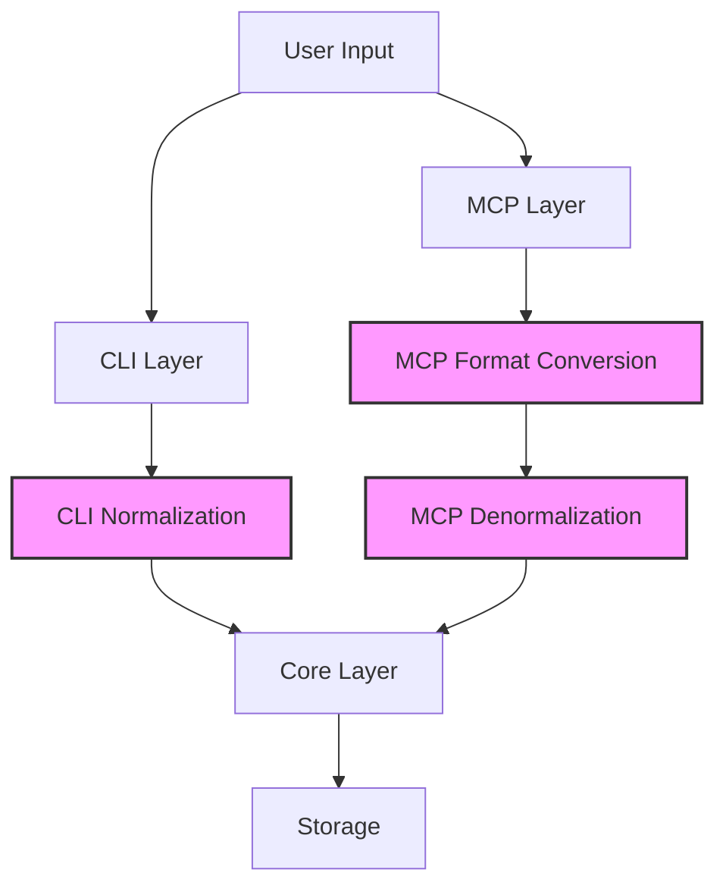
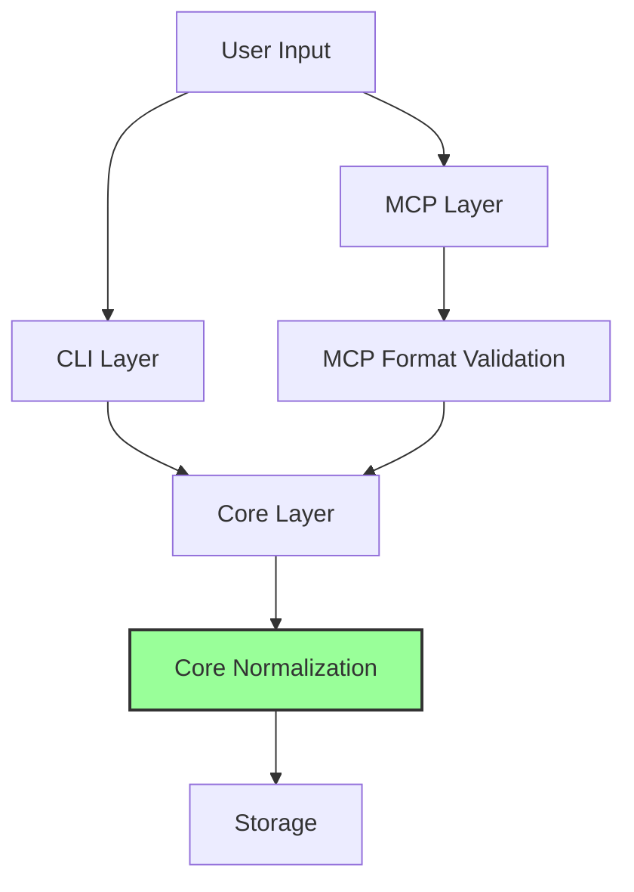

# Normalization Analysis: Current State and Refactoring Plan

## Overview

This document analyzes the current normalization patterns across CLI, MCP, and Core layers to understand what needs to be removed after core integration is complete. The goal is to centralize all normalization in the core layer while CLI and MCP layers handle only display formatting and API format conversion respectively.

## Current State of Normalization

### 1. CLI Layer (src/cli/commands.ts)

The CLI layer currently performs normalization in several places:

#### Priority Normalization
- **Location**: Lines 210-213 in `handleCreateCommand()`
- **Code**: 
  ```typescript
  const normalizedPriority = core.normalizePriority(options.priority);
  createOptions.customMetadata!.priority = normalizedPriority;
  ```
- **Also in**: Line 294 in `handleUpdateCommand()`
  ```typescript
  if (options.priority) frontmatter.priority = core.normalizePriority(options.priority);
  ```

#### Status Normalization
- **Implicit**: CLI passes status values directly as strings
- **No explicit normalization** but relies on core to handle it

#### Type Normalization
- **Location**: Lines 83-92 in `handleListCommand()`
- **Code**: Uses emoji-prefixed types internally
  ```typescript
  const typeMap: Record<string, string> = {
    feature: '🌟 Feature',
    bug: '🐞 Bug',
    chore: '🧹 Chore',
    documentation: '📖 Documentation',
    test: '🧪 Test',
    spike: '💡 Spike/Research',
  };
  ```

### 2. MCP Layer

#### normalized-handlers.ts
Converts between clean enum values and core format:

- **Type conversion** (lines 83-92):
  ```typescript
  const typeMap: Record<string, string> = {
    feature: '🌟 Feature',
    bug: '🐞 Bug',
    // ... etc
  };
  listOptions.type = typeMap[params.type] as core.TaskType;
  ```

- **Status conversion** (lines 96-104):
  ```typescript
  const statusMap: Record<string, string> = {
    todo: 'To Do',
    in_progress: 'In Progress',
    done: 'Done',
    blocked: 'Blocked',
    archived: 'Archived',
  };
  listOptions.status = statusMap[params.status] as core.TaskStatus;
  ```

#### transformers.ts
Contains comprehensive normalization functions:

- **`cleanTaskType()`** (lines 41-49): Validates task types, returns canonical names
- **`normalizeStatus()`** (lines 55-59): Converts core format to MCP format
- **`denormalizeStatus()`** (lines 65-70): Converts MCP format to core format
- **`normalizePriority()`** (lines 87-93): Converts core format to MCP format
- **`denormalizePriority()`** (lines 76-81): Converts MCP format to core format
- **`normalizeWorkflowState()`** (lines 99-109): Validates workflow states

#### normalized-write-handlers.ts
Uses denormalization functions when creating/updating:

- **Task creation** (lines 69, 109): 
  ```typescript
  status: params.status ? denormalizeStatus(params.status) : undefined
  ```
- **Priority handling** (lines 118, 541):
  ```typescript
  createOptions.customMetadata.priority = denormalizePriority(params.priority);
  ```
- **Update operations** (lines 186-189):
  ```typescript
  if (params.updates.status)
    frontmatter.status = denormalizeStatus(params.updates.status) as core.TaskStatus;
  if (params.updates.priority)
    frontmatter.priority = denormalizePriority(params.updates.priority) as core.TaskPriority;
  ```

### 3. Core Layer (src/core)

#### field-normalizers.ts
Contains the actual normalization logic:

- **`normalizePriority()`**: Handles various input formats (emoji, text, synonyms)
- **`normalizeTaskStatus()`**: Normalizes status values with many variations
- **`isCompletedTaskStatus()`**: Detects completed tasks
- **`getPriorityOrder()`**: For sorting tasks

#### task-crud.ts
- **Uses normalized values** in filters (lines 634-647)
- **No normalization on create/update** - expects already normalized values
- **Problem**: Core expects normalized values but doesn't normalize on input

## Data Flow Analysis

### Current Flow



### Desired Flow



## Problems Identified

1. **Double Normalization**: CLI normalizes priority, then core might normalize again
2. **Inconsistent Responsibility**: Some normalization in CLI, some in MCP, some expected by core
3. **Type System Confusion**: Core stores emojis with types, but new schema system uses canonical names
4. **MCP Complexity**: Complex conversion between API format and core format
5. **Core Assumption**: Core expects normalized input but doesn't actually normalize on create/update

## Refactoring Plan

### Phase 1: Update Core to Normalize on Input
1. Modify `create()` in task-crud.ts to normalize all input fields
2. Modify `update()` to normalize all input fields
3. Ensure core always stores canonical names (no emojis in storage)

### Phase 2: Remove CLI Normalization
1. Remove `core.normalizePriority()` calls from commands.ts
2. Pass raw user input directly to core
3. Update CLI to display values using schema service for formatting

### Phase 3: Simplify MCP Layer
1. Keep format validation in MCP (ensure valid enum values)
2. Remove denormalization functions - pass validated input to core
3. Keep normalization for output only (core format to API format)
4. Simplify transformers.ts to focus on output transformation

### Phase 4: Testing & Validation
1. Test all CLI commands with various input formats
2. Test MCP API with various input formats
3. Verify no double-normalization
4. Ensure backward compatibility

## Key Files to Modify

### CLI Layer
- `src/cli/commands.ts`: Remove normalizePriority calls (lines 210-213, 294)

### MCP Layer
- `src/mcp/normalized-handlers.ts`: Remove type/status conversion maps
- `src/mcp/transformers.ts`: Keep output normalization, remove input denormalization
- `src/mcp/normalized-write-handlers.ts`: Remove all denormalization calls

### Core Layer
- `src/core/task-crud.ts`: Add normalization to create() and update() functions
- Ensure core uses field-normalizers.ts consistently

## Migration Strategy

1. **Start with Core**: Ensure core normalizes all input properly
2. **Test Core**: Verify core handles all input variations
3. **Remove CLI normalization**: One field at a time
4. **Simplify MCP**: Remove denormalization, keep validation
5. **Final cleanup**: Remove unused functions and imports

## Success Criteria

- [ ] Core normalizes all input fields on create/update
- [ ] CLI passes raw user input to core
- [ ] MCP validates but doesn't transform input
- [ ] All tests pass with various input formats
- [ ] No double-normalization occurs
- [ ] Clean separation of concerns achieved