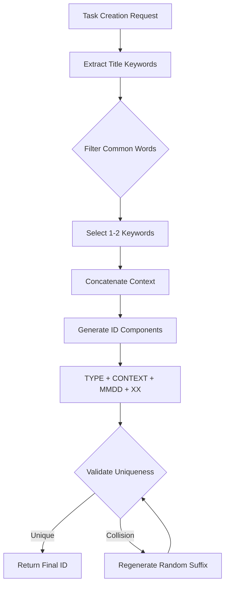

+++
id = "REQ-CONCISEID-0518"
title = "Requirements Document for Concise Task ID Format"
type = "📄 Documentation"
status = "🟢 Done"
priority = "🔼 High"
created_date = "2025-05-18"
updated_date = "2025-05-18"
assigned_to = ""
phase = "planning"
subdirectory = "proposals"
tags = [
  "planning",
  "proposal",
  "feature",
  "task-management",
  "id-generation"
]
proposed_by = "Development Team"
related_docs = [ ]
related_tasks = [ ]
estimated_effort = "Medium"
target_release = "v1.1"
+++

# Implement Concise Task ID Format

## 1. Overview / Purpose 🎯

*   Implement a new concise task ID format that provides human-readable context while maintaining uniqueness and brevity
*   Replace current timestamp-based IDs with a format that includes task type, contextual keywords, date components, and a random suffix

## 2. Problem Statement 🤔

*   Current timestamp-based IDs (e.g., `TASK-20250518T165455`) have significant limitations:
    - Zero human-readable context about the task's purpose
    - Timestamp precision leads to collisions during batch task creation
    - IDs are unnecessarily long for most use cases
    - No semantic information for task grouping or searching
*   The lack of context in task IDs makes it difficult to quickly identify tasks without reading full titles
*   Timestamp collision causes failures when creating multiple tasks programmatically

## 3. Proposed Solution ✨

*   Implement a new task ID format: `{TYPE}-{CONTEXT}-{MMDD}-{XX}`
    - **TYPE**: Single word task type (FEAT, BUG, CHORE, DOCS, etc.)
    - **CONTEXT**: First 1-2 significant words from title concatenated without dashes
    - **MMDD**: Month and day for temporal context
    - **XX**: 2-character random suffix for uniqueness
*   Example: `BUG-USERAUTH-0518-K3` for a bug related to user authentication created on May 18th
*   Context extraction algorithm:
    - Extract keywords from task title
    - Remove common words (the, a, an, etc.)
    - Take first 1-2 significant words
    - Concatenate without separators

## 4. Goals ✅

*   Eliminate timestamp-based collision issues during batch task creation
*   Provide human-readable context directly in task IDs
*   Reduce ID length while maintaining uniqueness
*   Enable progressive precision lookups (future enhancement)
*   Maintain backward compatibility with existing task references

## 5. Non-Goals ❌

*   This proposal does NOT include the progressive precision lookup feature (planned for future)
*   Will not modify existing task IDs - only applies to newly created tasks
*   Will not change the underlying storage or database schema
*   Does not include full natural language parsing for context extraction

## 6. Technical Design / Implementation Sketch 🛠️

*   Core components:
    - ID Generator service with configurable format
    - Context extractor with basic NLP for keyword extraction
    - Collision-resistant random suffix generator
    - Validation service to ensure ID uniqueness
*   Implementation approach:
    - Create new ID generation module in `src/core/task-manager/id-generator.ts`
    - Update task creation logic to use new generator
    - Add configuration options for format customization
    - Implement migration utilities for future use
*   Data flow:
    ```
    Task Title → Context Extractor → ID Generator → Validator → Final ID
    ```

## 7. Alternatives Considered 🔄

*   **UUID-based IDs**: Rejected due to lack of human readability
*   **Sequential numeric IDs**: Rejected due to synchronization challenges in distributed environments
*   **Hash-based IDs**: Rejected as they don't provide temporal or contextual information
*   **Hierarchical IDs**: Considered too complex for current requirements

## 8. Open Questions / Risks ❓

*   How to handle edge cases where title has no meaningful keywords?
*   Should context extraction be configurable per project?
*   What's the optimal length for the CONTEXT portion to balance readability and uniqueness?
*   How to ensure random suffix provides sufficient entropy for large projects?
*   Migration strategy for existing projects using old ID format

## 9. Diagrams / Visuals 📊



## 10. Related Links 🔗

*   [Task Management Documentation](/docs/MDTM.md)
*   [ID Format Specification](/docs/specs/id-format.md) (to be created)
