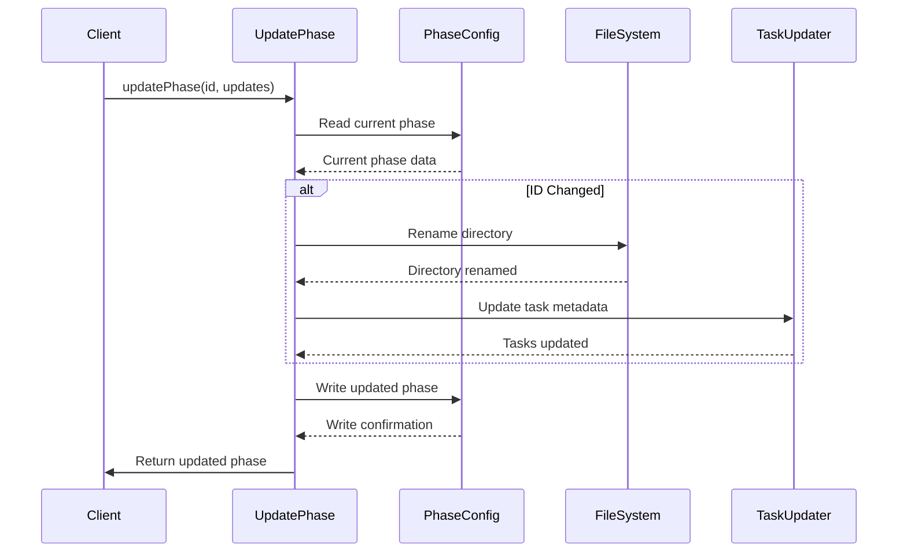

+++
id = "001_update_phase"
title = "Implement Phase Update Operation"
type = "🌟 Feature"
status = "🟢 Done"
priority = "🔼 High"
created_date = "2025-05-10"
updated_date = "2025-05-13"
assigned_to = ""
is_overview = false
phase = "release-v1.1"
subdirectory = "FEATURE_PhaseManagement"
parent_task = "_overview"
+++

# Implement Phase Update Operation

## Description ✍️

**What is this feature?**  
This feature implements the `updatePhase` function in the task management system to allow modifying existing phase properties. Currently, the system only supports creating and listing phases, but lacks the ability to update them after creation.

**Why is it needed?**  
Phases are a core organizational concept in the task management system. Without the ability to update phases, users must recreate phases if they need to change names, descriptions, or statuses, which is inefficient and can lead to data inconsistency. This update operation completes the CRUD functionality for phases.

**Scope:**  
This task focuses specifically on implementing the core `updatePhase` function in the task-manager.ts file, along with all necessary synchronization logic to maintain consistency between the phase configuration file and the directory structure.

**Links:**  
- Related to overall Phase Management Feature (`_overview.md`)
- Will be exposed via CLI in `003_cli_commands.md`
- Will be exposed via MCP in `004_mcp_methods.md`

## Acceptance Criteria ✅

- [x] Function allows updating phase name, description, and status properties
- [x] Function allows updating additional phase properties (order, etc.)
- [x] Directory structure and phase configuration files remain in sync
- [x] Consistent error handling using `OperationResult<T>` pattern
- [x] Function prevents invalid states and maintains data integrity
- [x] Function correctly handles renaming of phase directory if ID changes 
- [x] Function preserves all tasks and relationships during updates
- [x] Task files' metadata is consistently updated when phase is renamed

## Implementation Notes / Sub-Tasks 📝

- [x] Design the `updatePhase` function signature
  ```typescript
  export async function updatePhase(
    id: string,
    updates: Partial<Phase>
  ): Promise<OperationResult<Phase>>
  ```

- [x] Implement core updating logic:
  - Retrieve current phase from configuration
  - Apply updates to phase object
  - Validate updates (prevent invalid states)
  - Update phase entry in configuration file

- [x] Handle directory operations for ID changes:
  - Allow ID changes and implement directory renaming
  - Create function to safely rename directories while preserving content
  - Implement validation to prevent conflicts 

- [x] Implement task metadata updates:
  - When a phase is renamed, update all task files' phase metadata
  - This ensures consistency between directory structure and metadata

- [x] Ensure proper error handling:
  - Check for non-existent phases
  - Handle file system errors
  - Return appropriate error messages
  - Roll back changes if a step fails

- [x] Add validation functions:
  - Validate phase ID format (ensure it can be used as a directory name)
  - Check for phase name uniqueness across all phases
  - Verify directory existence

- [x] Write comprehensive tests for the function

## Diagrams 📊



## Implementation Decisions

Based on validation with stakeholders, the following implementation decisions have been made:

1. **ID Change Handling**: The function will allow changing the phase ID and will rename the directory accordingly. This provides flexibility while maintaining consistency.

2. **Task Path Updates**: When a phase directory is renamed, all task files within it will be updated to reflect the new phase in their metadata. While potentially slower for large phases, this approach ensures data consistency.

3. **Phase Status Values**: The function will support the following standard status values with emoji prefixes:
   - "🟡 Planned" - For phases not yet started
   - "🔵 In Progress" - For phases currently being worked on
   - "🟢 Completed" - For phases that have been finished
   These align with the MDTM standard which uses emoji prefixes in status values.

4. **Validation Rules**: The function will apply these validation rules:
   - Phase IDs must be unique across the system
   - Phase names must be unique across the system
   - Phase IDs can contain letters, numbers, and underscores (spaces will be converted to underscores)
   - The function will prevent creation of invalid directory names

5. **FEATURE and AREA Subdirectories**: This task focuses ONLY on the phase level, not on FEATURE_* or AREA_* subdirectory management:
   - The FEATURE/AREA management is covered separately in task TASK-MDTM-FEATURE-COMMANDS
   - When renaming a phase, all subdirectories will be preserved in their current state
   - The function will properly maintain any existing FEATURE/AREA subdirectories within the phase

## Implementation Log

The `updatePhase` function has been successfully implemented with the following features:

1. Core updating logic that handles all phase properties (name, description, status, order)
2. Directory renaming when phase ID changes, preserving all content
3. Task metadata updates to ensure consistency between directory structure and task metadata
4. Comprehensive validation to prevent invalid states
5. Robust error handling using the standard `OperationResult<T>` pattern
6. Test cases to verify the functionality

The implementation properly supports the MDTM standard for phase management and ensures seamless updates to phases without any data loss or inconsistency.
