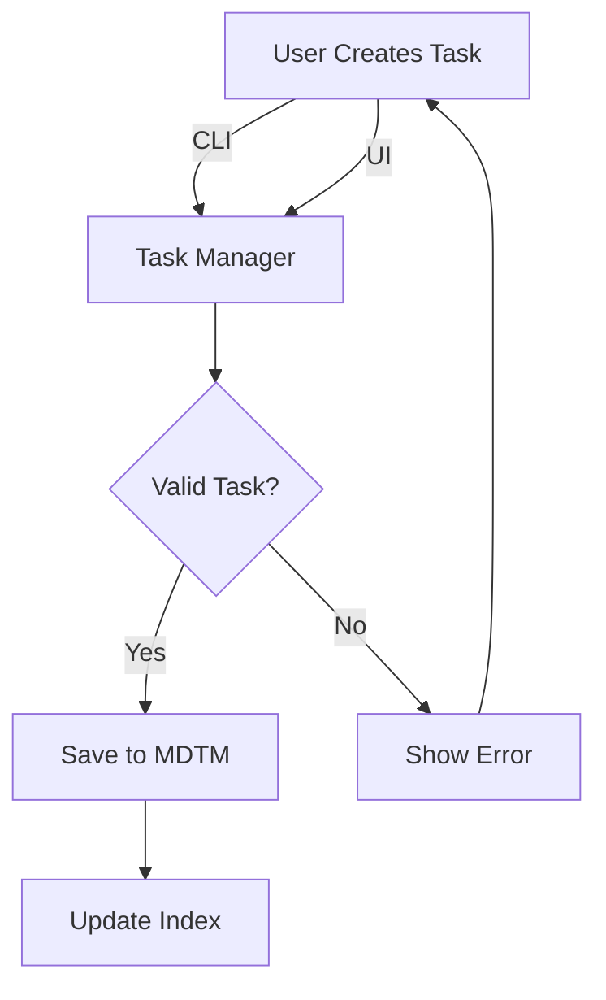
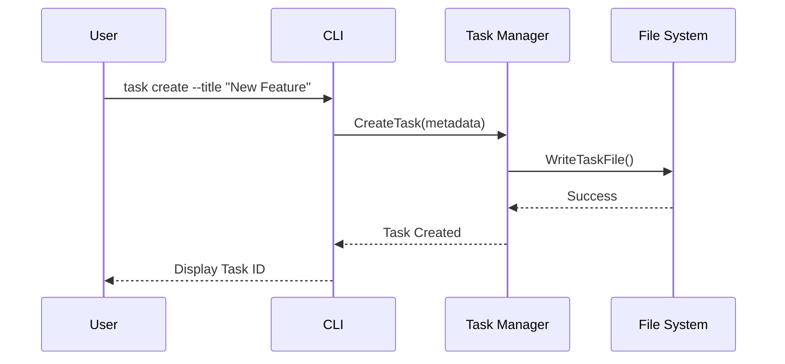
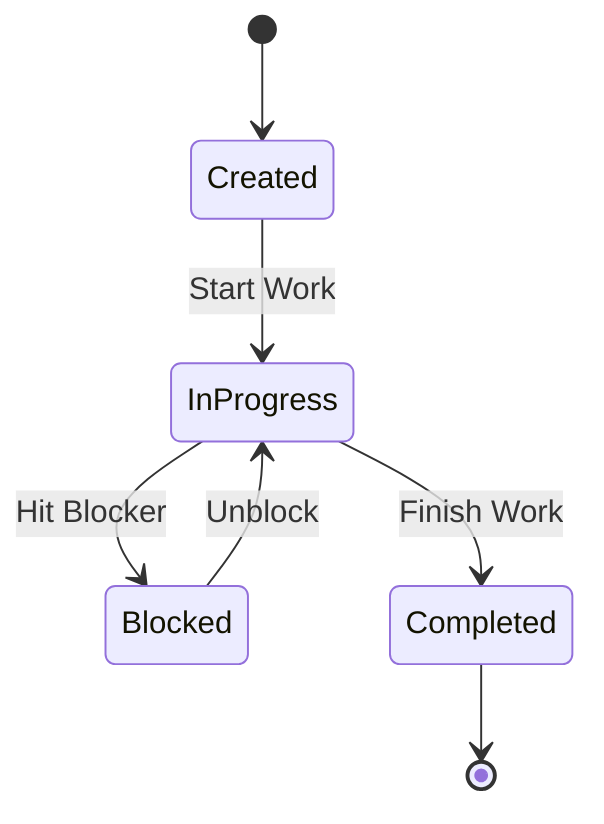
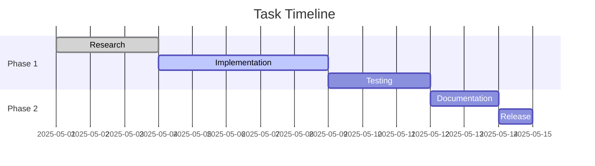
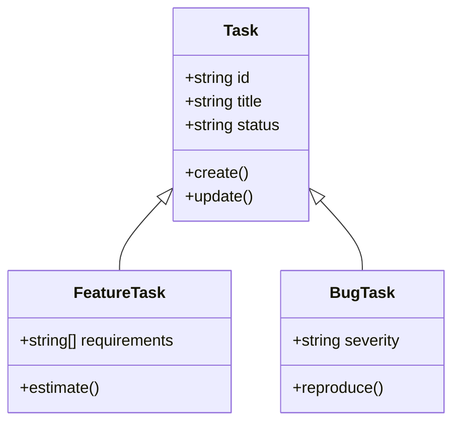
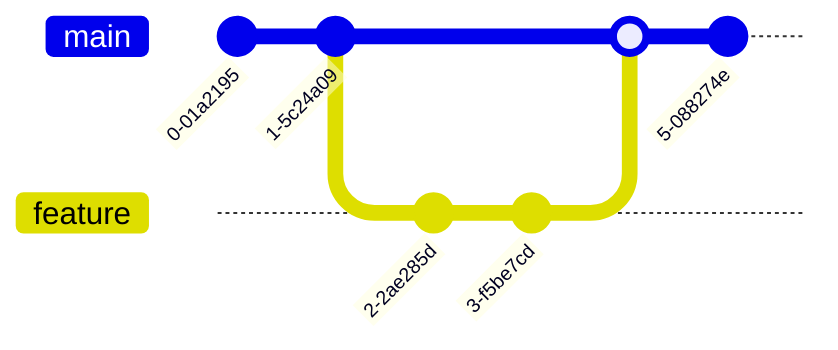
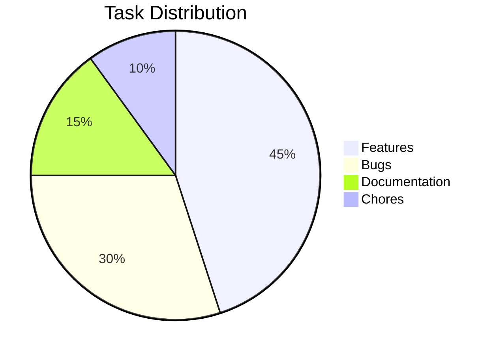
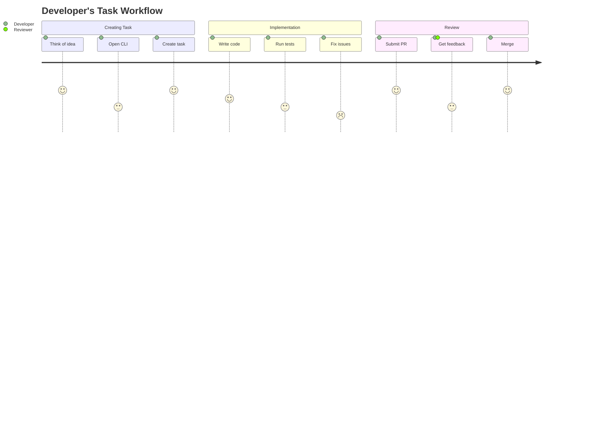
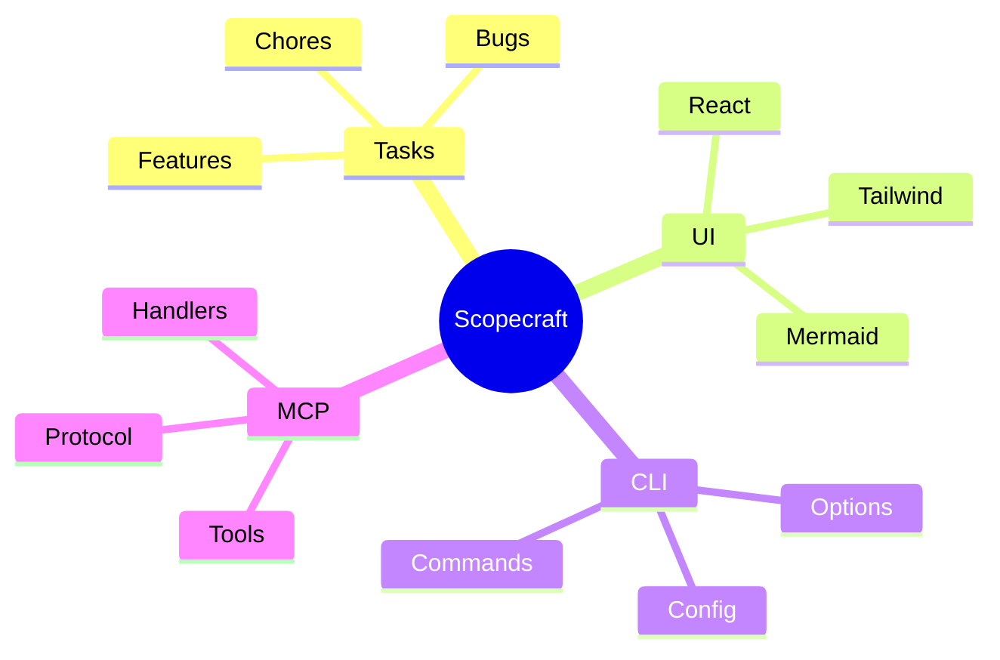

# Mermaid Diagram Examples

This document showcases various Mermaid diagram types that are now supported in Scopecraft's UI.

## Flowchart

## Sequence Diagram

## State Diagram

## Gantt Chart

## Class Diagram

## Git Graph

## Pie Chart

## Journey Diagram

## Mindmap

All these diagrams support both light and dark themes and will automatically adapt to your UI preference.