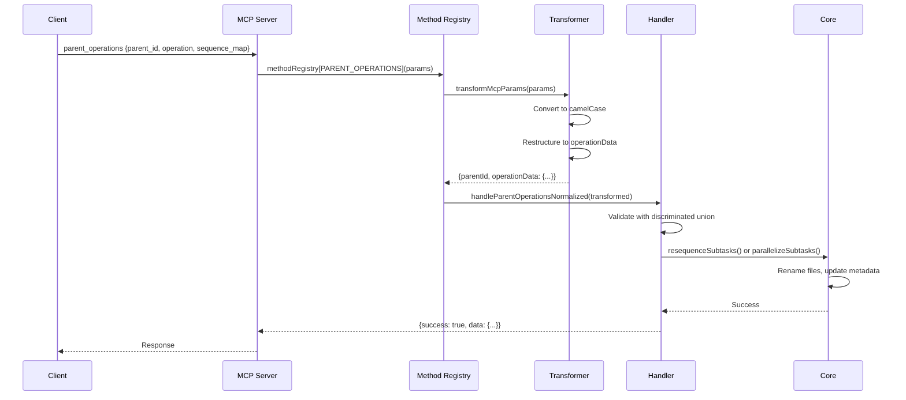

# MCP (Model Context Protocol) Architecture

## Overview

This document describes the architecture of the MCP implementation in the Scopecraft Command system. It covers the flow of data between different layers, the transformation pipeline, and how the system handles both read and write operations.

## Table of Contents

1. [Architecture Layers](#architecture-layers)
2. [Data Flow](#data-flow)
3. [Field Naming Convention](#field-naming-convention)
4. [Sequence Diagrams](#sequence-diagrams)
5. [File Structure](#file-structure)
6. [Key Components](#key-components)
7. [Common Patterns](#common-patterns)
8. [Troubleshooting](#troubleshooting)
9. [API Consumer Guide](#api-consumer-guide)

## Architecture Layers

The MCP implementation consists of several distinct layers:

```
┌─────────────────────────────────────────────────────────────┐
│                     External Clients                          │
│            (Claude, UI, CLI, other MCP clients)              │
└─────────────────────────────────────────────────────────────┘
                              │
                              ▼
┌─────────────────────────────────────────────────────────────┐
│                    MCP Protocol Layer                         │
│                   (JSON-RPC over stdio)                       │
│                  • Snake_case field names                     │
│                  • Tool registration                          │
└─────────────────────────────────────────────────────────────┘
                              │
                              ▼
┌─────────────────────────────────────────────────────────────┐
│                     MCP Server Layer                          │
│                    (core-server.ts)                          │
│                  • Tool definitions                           │
│                  • Parameter schemas                          │
│                  • Routes to method registry                  │
└─────────────────────────────────────────────────────────────┘
                              │
                              ▼
┌─────────────────────────────────────────────────────────────┐
│                    Method Registry                            │
│                     (handlers.ts)                            │
│                  • Maps methods to handlers                   │
│                  • Wraps with transformation                  │
└─────────────────────────────────────────────────────────────┘
                              │
                              ▼
┌─────────────────────────────────────────────────────────────┐
│                 Parameter Transformer                         │
│               (parameter-transformer.ts)                      │
│                • snake_case → camelCase                       │
│                • Special handling for nested structures       │
└─────────────────────────────────────────────────────────────┘
                              │
                              ▼
┌─────────────────────────────────────────────────────────────┐
│                    Handler Layer                              │
│      (normalized-handlers.ts, normalized-write-handlers.ts)  │
│                  • Zod validation                             │
│                  • Input normalization (aliases → canonical)  │
│                  • Business logic                             │
│                  • Response formatting                        │
└─────────────────────────────────────────────────────────────┘
                              │
                              ▼
┌─────────────────────────────────────────────────────────────┐
│                      Core Layer                               │
│                    (src/core/*)                              │
│                  • Task operations                            │
│                  • File system operations                     │
│                  • Business rules                             │
│                  • Stores canonical values only               │
│                  • Handles validation & defaults              │
└─────────────────────────────────────────────────────────────┘
                              │
                              ▼
┌─────────────────────────────────────────────────────────────┐
│                    Transformer Layer                          │
│                    (transformers.ts)                         │
│            • Pure structural transformation                   │
│            • core.Task → MCP.Task type conversion            │
│            • NO normalization (data already canonical)        │
│            • NO defaults (core handles all defaults)          │
└─────────────────────────────────────────────────────────────┘
```

## Data Flow

### Read Operation Flow

1. **Client Request** → MCP Server receives request with snake_case fields
2. **Tool Registration** → Server validates against registered schema
3. **Method Registry** → Routes to appropriate handler with transformation
4. **Parameter Transformer** → Converts snake_case to camelCase
5. **Handler** → Validates with Zod schema, calls core functions
6. **Core Layer** → Performs file operations, returns data
7. **Response Transformer** → Formats response with consistent envelope
8. **Client Response** → Returns normalized data structure

### Write Operation Flow

Similar to read operations, but with additional considerations:
- Field transformation is critical (e.g., `parent_id` → `parentId`)
- Some operations have nested structures (e.g., `parent_operations`)
- Validation ensures data integrity before core operations

## Field Naming Convention

The system handles two naming conventions:

| Layer | Convention | Example |
|-------|------------|---------|
| MCP Protocol | snake_case | `parent_id`, `workflow_state`, `include_content` |
| Internal/TypeScript | camelCase | `parentId`, `workflowState`, `includeContent` |

### Transformation Rules

```typescript
// Automatic transformations handled by camelcase-keys:
parent_id → parentId
workflow_state → workflowState
target_state → targetState
archive_date → archiveDate
sequence_map → sequenceMap
subtask_ids → subtaskIds

// Special case for parent_operations:
// Flat structure is restructured into nested operationData
{
  parent_id: "x",
  operation: "resequence",
  sequence_map: [...]
}
// Becomes:
{
  parentId: "x", 
  operation: "resequence",
  operationData: {
    operation: "resequence",
    sequenceMap: [...]
  }
}
```

## Sequence Diagrams

### Task Creation Flow

```mermaid
sequenceDiagram
    participant Client
    participant MCP Server
    participant Method Registry
    participant Transformer
    participant Handler
    participant Core
    participant FileSystem

    Client->>MCP Server: task_create {parent_id, title, type}
    MCP Server->>MCP Server: Validate against taskCreateSchema
    MCP Server->>Method Registry: methodRegistry[TASK_CREATE](params)
    Method Registry->>Transformer: transformMcpParams(params)
    Transformer->>Transformer: snake_case → camelCase
    Transformer-->>Method Registry: {parentId, title, type}
    Method Registry->>Handler: handleTaskCreateNormalized(transformed)
    Handler->>Handler: TaskCreateInputSchema.parse()
    Handler->>Core: createTask(projectRoot, options)
    Core->>FileSystem: Write .task.md file
    FileSystem-->>Core: Success
    Core-->>Handler: {success: true, data: task}
    Handler->>Handler: Format response
    Handler-->>Method Registry: Normalized response
    Method Registry-->>MCP Server: Response
    MCP Server-->>Client: {success: true, data: {...}}
```



### Parent Operations Flow



## File Structure

```
src/mcp/
├── core-server.ts           # MCP server setup, tool registration
├── handlers.ts              # Method registry, legacy handlers
├── parameter-transformer.ts # Field name transformation utilities
├── handler-wrapper.ts       # Wrapper for applying transformations
├── normalized-handlers.ts   # Read operation handlers
├── normalized-write-handlers.ts # Write operation handlers
├── schemas.ts              # Zod schemas for all operations
├── types.ts                # TypeScript type definitions
├── transformers.ts         # Data structure transformation (NOT normalization)
└── output-schemas.ts       # JSON schema generation for MCP
```

## Key Components

### 1. Method Registry (`handlers.ts`)

```typescript
export const methodRegistry: McpMethodRegistry = {
  // All handlers are wrapped with transformation
  [McpMethod.TASK_LIST]: createMcpHandler(handleTaskListNormalized),
  [McpMethod.TASK_CREATE]: createMcpHandler(handleTaskCreateNormalized),
  // ... etc
};
```

### 2. Parameter Transformer (`parameter-transformer.ts`)

```typescript
export function transformMcpParams(params: unknown): unknown {
  const transformed = camelcaseKeys(params, { deep: true });
  
  // Special handling for parent_operations
  if (transformed?.operation && (transformed.sequenceMap || ...)) {
    // Restructure flat params into nested operationData
  }
  
  return transformed;
}
```

### 3. Handler Pattern (`normalized-write-handlers.ts`)

```typescript
export async function handleTaskCreateNormalized(
  rawParams: unknown
): Promise<McpResponse<TaskCreateOutput['data']>> {
  try {
    // 1. Validate input with Zod
    const params = TaskCreateInputSchema.parse(rawParams);
    
    // 2. Build core options
    const createOptions: core.TaskCreateOptions = {
      title: params.title,
      type: params.type,
      // ...
    };
    
    // 3. Call core function
    const result = await core.createTask(projectRoot, createOptions);
    
    // 4. Format and validate response
    const response = TaskCreateOutputSchema.parse({
      success: true,
      data: outputData,
      message: `Task ${outputData.id} created successfully`,
      metadata: createResponseMetadata(),
    });
    
    return response;
  } catch (error) {
    // Handle errors consistently
  }
}
```

### 4. Core Server (`core-server.ts`)

```typescript
// Tool registration pattern
server.registerTool(
  'task_create',
  {
    description: 'Creates a new task...',
    inputSchema: taskCreateRawShape, // snake_case fields
    annotations: { /* ... */ },
  },
  async (params) => {
    try {
      // Use method registry instead of direct handler call
      const result = await methodRegistry[McpMethod.TASK_CREATE](params);
      return formatResponse(result);
    } catch (error) {
      return formatError(error);
    }
  }
);
```

### 5. Transformers (`transformers.ts`)

**IMPORTANT**: Transformers do NOT normalize data. They only convert data structures.

```typescript
// CORRECT: Pure structural transformation
function transformBaseTask(task: core.Task) {
  return {
    id: task.metadata.id,
    title: task.document.title,
    type: task.document.frontmatter.type as TaskType,  // Direct type assertion
    status: task.document.frontmatter.status as TaskStatus,  // NO normalization
    priority: task.document.frontmatter.priority as TaskPriority,  // NO defaults
    // ... other fields
  };
}

// WRONG: Do NOT do normalization in transformers
// normalizeStatus(task.document.frontmatter.status) ❌
// task.document.frontmatter.area || 'general' ❌
```

Key principles:
- Core data is already canonical (validated, normalized, with defaults)
- Transformers only reshape data structure (core.Task → MCP.Task)
- Use direct type assertions, not normalization functions
- Trust that core has already done its job

## Common Patterns

### 1. Consistent Response Format

All operations return responses in this format:

```typescript
{
  success: boolean,
  data?: T,              // Operation-specific data
  error?: string,        // Error message if failed
  message: string,       // Human-readable message
  metadata?: {
    timestamp: string,   // ISO 8601 timestamp
    version: string,     // API version
    warnings?: string[]  // Non-fatal issues
  }
}
```

### 2. Zod Schema Validation

Every operation has input and output schemas:

```typescript
// Input validation
const params = TaskCreateInputSchema.parse(rawParams);

// Output validation
const response = TaskCreateOutputSchema.parse({...});
```

### 3. Error Handling

```typescript
try {
  // Operation logic
} catch (error) {
  if (error instanceof z.ZodError) {
    return {
      success: false,
      error: JSON.stringify(error.errors),
      message: 'Validation failed',
      metadata: createResponseMetadata(),
    };
  }
  // Other error handling
}
```

## Troubleshooting

### Common Issues

1. **Field Name Mismatches**
   - **Symptom**: "Required field missing" errors
   - **Cause**: snake_case/camelCase mismatch
   - **Solution**: Check parameter transformer is working

2. **Silent Failures**
   - **Symptom**: Operation succeeds but doesn't do expected work
   - **Cause**: Unrecognized fields are ignored
   - **Solution**: Verify field names match schema

3. **Nested Structure Issues**
   - **Symptom**: `parent_operations` fails with validation error
   - **Cause**: Expects nested `operationData` structure
   - **Solution**: Parameter transformer handles this special case

### Debugging Tips

1. **Enable transformation logging**:
   ```bash
   DEBUG_MCP_TRANSFORM=1 bun run mcp:stdio
   ```

2. **Test transformations directly**:
   ```typescript
   import { transformMcpParams } from './src/mcp/parameter-transformer.js';
   console.log(transformMcpParams({ parent_id: "test" }));
   ```

3. **Check handler is wrapped**:
   - Verify handler is called through `methodRegistry`
   - Ensure `createMcpHandler` wrapper is applied

### Adding New Operations

1. **Define schemas** in `schemas.ts`:
   ```typescript
   export const NewOperationInputSchema = WriteOperationContextSchema.extend({
     // Define fields using camelCase
   });
   ```

2. **Create handler** in appropriate file:
   ```typescript
   export async function handleNewOperationNormalized(rawParams: unknown) {
     const params = NewOperationInputSchema.parse(rawParams);
     // Implementation
   }
   ```

3. **Add to method registry** in `handlers.ts`:
   ```typescript
   [McpMethod.NEW_OPERATION]: createMcpHandler(handleNewOperationNormalized),
   ```

4. **Register tool** in `core-server.ts`:
   ```typescript
   server.registerTool('new_operation', {
     inputSchema: newOperationRawShape, // Use snake_case
   }, async (params) => {
     const result = await methodRegistry[McpMethod.NEW_OPERATION](params);
     return formatResponse(result);
   });
   ```

## API Consumer Guide

### Clean Enum Values

All enum values are clean strings without emoji prefixes:

#### Task Types
- `"feature"` (not "🌟 Feature")
- `"bug"` (not "🐞 Bug")
- `"chore"` (not "🧹 Chore")
- `"documentation"` (not "📚 Documentation")
- `"test"` (not "🧪 Test")
- `"spike"` (not "💡 Spike/Research")

#### Task Status
- `"todo"` (not "To Do")
- `"in_progress"` (not "In Progress")
- `"done"` (not "Done")
- `"blocked"` (not "Blocked")
- `"archived"` (not "Archived")

#### Priority Levels
- `"highest"`
- `"high"`
- `"medium"`
- `"low"`

#### Workflow States
- `"backlog"`
- `"current"`
- `"archive"`

### API Endpoints Reference

#### Read Operations

**task_list** - Lists tasks with comprehensive filtering
```typescript
// Request
{
  workflowState?: 'backlog' | 'current' | 'archive' | string[];
  area?: string;
  type?: TaskType;
  status?: TaskStatus;
  priority?: TaskPriority;
  assignee?: string;
  tags?: string[];
  taskType?: 'simple' | 'parent' | 'subtask' | 'top-level' | 'all';
  includeContent?: boolean;
  includeCompleted?: boolean;
  includeArchived?: boolean;
  includeParentTasks?: boolean;
}
```

**task_get** - Retrieves a specific task with full details
```typescript
// Request
{
  id: string;
  parentId?: string; // For subtask resolution
  format?: 'full' | 'summary';
}
```

**parent_list** - Lists parent tasks with progress information
```typescript
// Request
{
  workflowState?: 'backlog' | 'current' | 'archive' | string[];
  area?: string;
  includeProgress?: boolean;
  includeSubtasks?: boolean;
}
```

**parent_get** - Retrieves a parent task with all subtasks
```typescript
// Request
{
  id: string;
}
```

#### Write Operations

**task_create** - Creates a new task
```typescript
// Request
{
  title: string;
  type: TaskType;
  area?: string;
  status?: TaskStatus;
  priority?: TaskPriority;
  workflowState?: WorkflowState;
  parentId?: string; // For creating subtasks
  assignee?: string;
  tags?: string[];
  instruction?: string;
  tasks?: string; // Markdown checklist
}
```

**task_update** - Updates an existing task
```typescript
// Request
{
  id: string;
  parentId?: string; // For subtask resolution
  updates: {
    title?: string;
    status?: TaskStatus;
    priority?: TaskPriority;
    area?: string;
    assignee?: string;
    tags?: string[];
    // Content sections
    instruction?: string;
    tasks?: string;
    deliverable?: string;
    log?: string;
    addLogEntry?: string; // Convenience for appending to log
  };
}
```

**task_move** - Moves a task between workflow states
```typescript
// Request
{
  id: string;
  parentId?: string;
  targetState: 'backlog' | 'current' | 'archive';
  updateStatus?: boolean; // Auto-update status based on state
  archiveDate?: string; // YYYY-MM for archive moves
}
```

**parent_operations** - Performs operations on parent task subtasks
```typescript
// Request
{
  parentId: string;
  operation: 'resequence' | 'parallelize' | 'add_subtask';
  // Operation-specific fields...
}
```


### Best Practices

1. **Always validate inputs** using Zod schemas when available
2. **Check `success` field** before accessing `data`
3. **Use `taskStructure` field** for discriminated unions
4. **Handle errors gracefully** with the consistent error format
5. **Use TypeScript** for better type safety with the API

### Token Efficiency

The API is designed for token efficiency:

- Use `includeContent: false` (default) when listing tasks
- Use `includeSubtasks: false` (default) when listing parents
- Request only the fields you need
- Use appropriate filters to reduce response size


## Related Documentation

- [MCP Tool Descriptions](./mcp-tool-descriptions.md) - User-facing tool documentation
- [Task System Design](./specs/task-system-design.md) - Core task system architecture
- [System Architecture](./system-architecture.md) - Overall system design