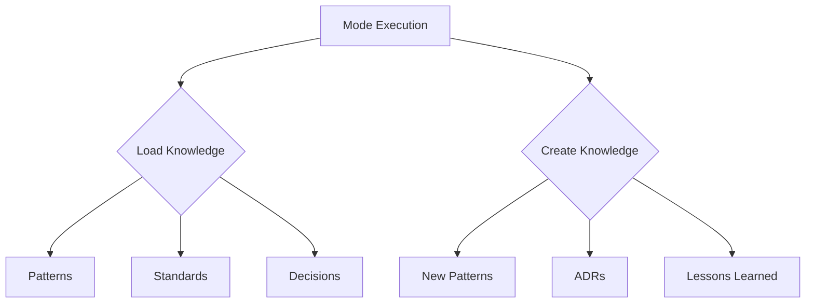

# Mode System Design

*Part of the [Scopecraft Vision](./scopecraft-vision.md)*

## Overview

The Mode System is an optional orchestration layer that guides AI agents and humans through common development workflows. It provides structured approaches to different types of work while maintaining the flexibility and composability that defines Scopecraft's Unix philosophy.

## Role: The Workflow Guide

The Mode System acts as an experienced colleague, providing:
- **Structured Workflows**: Step-by-step guidance for common tasks
- **Contextual Expertise**: The right mindset for each type of work
- **Consistent Outputs**: Predictable formats for deliverables
- **Progressive Automation**: From human-guided to autonomous execution

## Design Philosophy

### 1. Mindset Over Process
Modes establish a mental model and approach rather than rigid procedures. "You are exploring" vs "You are implementing" changes how work is approached.

### 2. Composable Workflows
Modes can be chained, run in parallel, or used independently. They're tools in a toolkit, not stages in a pipeline.

### 3. Human-in-the-Loop First
Modes are designed for human oversight by default. Autonomous execution is earned through proven patterns and explicit configuration.

### 4. Context-Aware Execution
Modes consume and produce Scopecraft entities (tasks, work documents, knowledge) maintaining full context across workflow steps.

## The Six Core Modes

### 1. Planning Mode
**Mindset**: "Break this down into manageable pieces"
- **Input**: Feature request, epic, or large task
- **Process**: Analyze scope, identify components, find dependencies
- **Output**: Subtasks with relationships and suggested sequence
- **Expertise Options**: `project-manager`, `tech-lead`, `architect`

### 2. Exploration Mode  
**Mindset**: "Understand the problem space deeply"
- **Input**: Question, problem, or area to investigate
- **Process**: Research patterns, analyze code, gather examples
- **Output**: Findings document, recommendations, examples
- **Expertise Options**: `researcher`, `domain-expert`, `security-analyst`

### 3. Design Mode
**Mindset**: "Make informed technical decisions"
- **Input**: Requirements and constraints
- **Process**: Evaluate options, consider trade-offs, choose approach
- **Output**: Technical approach document, architecture decisions
- **Expertise Options**: `architect`, `ui-designer`, `api-designer`

### 4. Implementation Mode
**Mindset**: "Build the solution correctly"
- **Input**: Clear requirements and design
- **Process**: Write code, create tests, update documentation
- **Output**: Working code, tests, updated docs
- **Expertise Options**: `developer`, `test-engineer`, `frontend-dev`

### 5. Diagnosis Mode
**Mindset**: "Find and fix the root cause"
- **Input**: Bug report, performance issue, failure
- **Process**: Investigate, reproduce, analyze, propose fix
- **Output**: Root cause analysis, fix approach
- **Expertise Options**: `debugger`, `performance-engineer`, `sre`

### 6. Evolution Mode
**Mindset**: "Improve without breaking"
- **Input**: Existing code and improvement goals
- **Process**: Analyze, refactor, optimize, modernize
- **Output**: Improved code with same behavior
- **Expertise Options**: `refactoring-expert`, `optimizer`, `modernizer`

## Mode Execution Framework

### Invocation Patterns

```bash
# Basic mode invocation
sc mode explore @task:AUTH-001

# With specific expertise
sc mode implement @task:AUTH-001 --expertise=security-engineer

# With automation level
sc mode explore @feature:oauth --auto=guided

# Chained execution
sc mode explore @feature:payments | sc mode design | sc mode plan
```

### Automation Levels

Each mode supports different levels of human involvement:

| Level | Human Involvement | When to Use |
|-------|------------------|-------------|
| **Autonomous** | Review results only | Well-understood patterns |
| **Guided** | Answer specific questions | Some decisions needed |
| **Collaborative** | Active participation | Complex or critical work |
| **Manual** | Human drives, AI assists | Learning or sensitive tasks |

### Context Flow

```
Previous Task State
        ↓
   Mode Input
        ↓
 [Mode Execution]
        ↓
  Updated State
        ↓
  Next Mode/Task
```

Each mode:
1. Loads task context from Scopecraft
2. Gathers related knowledge and work documents
3. Executes with appropriate expertise
4. Updates task with findings/output
5. Suggests next steps

## Mode Templates

### Structure of a Mode

```yaml
# modes/exploration.yaml
name: exploration
description: Research and understand problem spaces

expertise_options:
  researcher:
    focus: "Academic and industry research"
    tools: [WebSearch, Read, Knowledge Query]
  
  code-analyst:
    focus: "Codebase exploration and patterns"
    tools: [Grep, Read, Dependency Analysis]
    
  domain-expert:
    focus: "Business domain understanding"
    tools: [Read Docs, Interview Simulation]

automation_levels:
  autonomous:
    - Pattern searching
    - Documentation analysis
    - Dependency mapping
    
  guided:
    - Architecture exploration
    - New domain research
    - Security analysis
    
output_template: |
  ## Exploration Findings
  
  ### Context
  [What was explored and why]
  
  ### Key Findings
  1. [Finding with evidence]
  2. [Finding with evidence]
  
  ### Patterns Identified
  - [Pattern]: [Where found]
  
  ### Recommendations
  1. [Actionable recommendation]
  
  ### Questions for Human
  1. [Clarification needed]
  
  ### Suggested Next Steps
  - [Next mode or action]
```

### Mode Prompts

Each mode has structured prompts that establish:

```markdown
---
systemPrompt: |
  You are in {mode} mode with {expertise} expertise.
  Your goal is to {mode_goal}.
  
  Project context:
  - Test command: bun test
  - Lint command: bun run check
  - Knowledge base: /knowledge
  
allowedTools: {mode_specific_tools}
---

# {Mode} Mode: {Task Title}

## Loaded Context
<task>
{task_content}
</task>

<related_knowledge>
{auto_loaded_patterns}
</related_knowledge>

<work_documents>
{feature_prd}
{technical_approach}
</work_documents>

## Your Mission
{mode_specific_instructions}

## Output Format
{required_sections}

## Before Completing
{validation_checklist}
```

## Integration Architecture

### With Task System

Modes operate on tasks as their primary unit of work:


### With Knowledge System

Modes consume and contribute to knowledge:



### With External Tools

Modes can integrate with any tool via:
- File system (read/write markdown)
- MCP protocol (structured communication)
- Command execution (git, tests, builds)
- Web APIs (GitHub, Linear, etc.)

## Advanced Features

### Mode Composition

#### Sequential Composition
```bash
# Explore → Design → Plan → Implement
sc mode compose @feature:oauth \
  --sequence="explore,design,plan,implement"
```

#### Parallel Exploration
```bash
# Research security and performance simultaneously
sc mode parallel @feature:api-gateway \
  --modes="explore:security,explore:performance"
```

#### Conditional Flows
```yaml
# In mode configuration
next_mode:
  - condition: "has_security_concerns"
    suggest: "explore:security"
  - condition: "has_complex_architecture"  
    suggest: "design:architect"
  - default: "implement:developer"
```

### Question Protocol

Modes use a formal protocol for human interaction:

```typescript
interface ModeQuestion {
  id: string;
  context: string;
  question: string;
  options?: string[];
  blocking: boolean;
  impacts: string[];
}

// Example usage in mode
{
  id: "auth-method",
  context: "Found existing session management",
  question: "Should we use JWT or session-based auth?",
  options: ["JWT", "Sessions", "Hybrid"],
  blocking: true,
  impacts: ["Architecture", "Scaling strategy"]
}
```

### Mode Learning

Modes can adapt based on usage:

1. **Pattern Recognition**: Identify common execution paths
2. **Preference Learning**: Remember team decisions
3. **Optimization**: Suggest automation for proven patterns
4. **Vocabulary Adaptation**: Learn team-specific terms

## Example Workflows

### Feature Development Flow

```bash
# 1. Understand the request
sc mode explore "Add OAuth2 login" --expertise=researcher

# 2. Design the solution
sc mode design @task:EXPLORE-OAUTH-001 --expertise=architect

# 3. Break down the work
sc mode plan @feature:oauth-login

# 4. Implement components (parallel)
sc mode implement @task:OAUTH-BACKEND-001 &
sc mode implement @task:OAUTH-FRONTEND-001 &

# 5. Fix any issues
sc mode diagnose @bug:OAUTH-TOKEN-EXPIRY

# 6. Improve the code
sc mode evolve @module:auth-service --focus=performance
```

### Bug Investigation Flow

```bash
# 1. Understand the issue
sc mode diagnose @bug:LOGIN-TIMEOUT --auto=guided

# 2. Explore related code
sc mode explore @module:auth-service --focus=timeouts

# 3. Implement fix
sc mode implement @task:FIX-LOGIN-TIMEOUT

# 4. Prevent future issues
sc mode evolve @module:auth-service --focus=resilience
```

## Best Practices

### 1. Start Simple
Begin with basic mode invocation and add complexity as patterns emerge:
```bash
# Start with
sc mode explore @task:NEW-FEATURE

# Evolve to
sc mode explore @task:NEW-FEATURE --expertise=security --auto=guided
```

### 2. Mode Selection
Choose modes based on what you need to do, not where you are in a process:
- Need understanding? → Exploration
- Need decisions? → Design  
- Need breakdown? → Planning
- Need code? → Implementation

### 3. Expertise Matching
Match expertise to the problem:
- Security concerns → `security-analyst`
- Performance issues → `performance-engineer`
- User experience → `ui-designer`
- System design → `architect`

### 4. Automation Progression
Start collaborative, automate what proves stable:
1. Manual mode for new patterns
2. Collaborative for establishing patterns
3. Guided for proven patterns
4. Autonomous for routine work

### 5. Context Preservation
Always update tasks with mode outputs:
- Findings from exploration
- Decisions from design
- Subtasks from planning
- Code from implementation

## Future Enhancements

### Intelligent Mode Suggestion
AI analyzes task content and suggests appropriate mode:
```
Task: "Users report slow page loads"
AI: "This seems like a performance issue. Suggested flow:
     1. diagnose:performance-engineer
     2. explore:codebase
     3. evolve:optimizer"
```

### Mode Templates
Community-shared mode configurations:
```bash
# Use community template
sc mode apply @template:security-audit @module:payment

# Share your template
sc mode share my-custom-review-mode
```

### Mode Analytics
Track mode effectiveness:
- Which modes lead to successful outcomes
- Average time per mode execution
- Common mode sequences
- Automation success rates

---

The Mode System provides structured guidance while maintaining Scopecraft's philosophy of flexibility and composability. It's a power tool for those who want it, completely optional for those who don't.