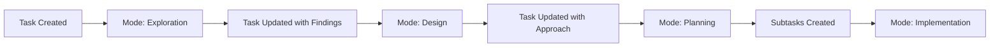

# Mode System Design

*Part of the [Scopecraft Vision](./scopecraft-vision.md)*

## Overview

The Mode System is an optional orchestration layer that guides AI agents and humans through common development workflows. It provides structured approaches to different types of work while maintaining the flexibility and composability that defines Scopecraft's Unix philosophy.

## Role: The Workflow Guide

The Mode System acts as an experienced colleague, providing:
- **Structured Workflows**: Step-by-step guidance for common tasks
- **Contextual Expertise**: The right mindset for each type of work
- **Consistent Outputs**: Predictable formats for deliverables
- **Progressive Automation**: From human-guided to autonomous execution

## Design Philosophy

### 1. Mindset Over Process
Modes establish a mental model and approach rather than rigid procedures. "You are exploring" vs "You are implementing" changes how work is approached.

### 2. Composable Workflows
Modes can be chained, run in parallel, or used independently. They're tools in a toolkit, not stages in a pipeline.

### 3. Human-in-the-Loop First
Modes are designed for human oversight by default. Autonomous execution is earned through proven patterns and explicit configuration.

### 4. Context-Aware Execution
Modes consume and produce Scopecraft entities (tasks, work documents, knowledge) maintaining full context across workflow steps.

## The Six Core Modes

### 1. Planning Mode
**Mindset**: "Break this down into manageable pieces"
- **Input**: Feature request, epic, or large task
- **Process**: Analyze scope, identify components, find dependencies
- **Output**: Subtasks with relationships and suggested sequence
- **Expertise Options**: `project-manager`, `tech-lead`, `architect`

### 2. Exploration Mode  
**Mindset**: "Understand the problem space deeply"
- **Input**: Question, problem, or area to investigate
- **Process**: Research patterns, analyze code, gather examples
- **Output**: Findings document, recommendations, examples
- **Expertise Options**: `researcher`, `domain-expert`, `security-analyst`

### 3. Design Mode
**Mindset**: "Make informed technical decisions"
- **Input**: Requirements and constraints
- **Process**: Evaluate options, consider trade-offs, choose approach
- **Output**: Technical approach document, architecture decisions
- **Expertise Options**: `architect`, `ui-designer`, `api-designer`

### 4. Implementation Mode
**Mindset**: "Build the solution correctly"
- **Input**: Clear requirements and design
- **Process**: Write code, create tests, update documentation
- **Output**: Working code, tests, updated docs
- **Expertise Options**: `developer`, `test-engineer`, `frontend-dev`

### 5. Diagnosis Mode
**Mindset**: "Find and fix the root cause"
- **Input**: Bug report, performance issue, failure
- **Process**: Investigate, reproduce, analyze, propose fix
- **Output**: Root cause analysis, fix approach
- **Expertise Options**: `debugger`, `performance-engineer`, `sre`

### 6. Evolution Mode
**Mindset**: "Improve without breaking"
- **Input**: Existing code and improvement goals
- **Process**: Analyze, refactor, optimize, modernize
- **Output**: Improved code with same behavior
- **Expertise Options**: `refactoring-expert`, `optimizer`, `modernizer`

## Mode Execution Framework

### Invocation Patterns

```bash
# Basic mode invocation
sc mode explore @task:AUTH-001

# With specific expertise
sc mode implement @task:AUTH-001 --expertise=security-engineer

# With automation level
sc mode explore @feature:oauth --auto=guided

# Chained execution
sc mode explore @feature:payments | sc mode design | sc mode plan
```

### Automation Levels

Each mode supports different levels of human involvement:

| Level | Human Involvement | When to Use |
|-------|------------------|-------------|
| **Autonomous** | Review results only | Well-understood patterns |
| **Guided** | Answer specific questions | Some decisions needed |
| **Collaborative** | Active participation | Complex or critical work |
| **Manual** | Human drives, AI assists | Learning or sensitive tasks |

### Context Flow

```
Previous Task State
        ↓
   Mode Input
        ↓
 [Mode Execution]
        ↓
  Updated State
        ↓
  Next Mode/Task
```

Each mode:
1. Loads task context from Scopecraft
2. Gathers related knowledge and work documents
3. Executes with appropriate expertise
4. Updates task with findings/output
5. Suggests next steps

## Mode Templates

### Structure of a Mode

```yaml
# modes/exploration.yaml
name: exploration
description: Research and understand problem spaces

expertise_options:
  researcher:
    focus: "Academic and industry research"
    tools: [WebSearch, Read, Knowledge Query]
  
  code-analyst:
    focus: "Codebase exploration and patterns"
    tools: [Grep, Read, Dependency Analysis]
    
  domain-expert:
    focus: "Business domain understanding"
    tools: [Read Docs, Interview Simulation]

automation_levels:
  autonomous:
    - Pattern searching
    - Documentation analysis
    - Dependency mapping
    
  guided:
    - Architecture exploration
    - New domain research
    - Security analysis
    
output_template: |
  ## Exploration Findings
  
  ### Context
  [What was explored and why]
  
  ### Key Findings
  1. [Finding with evidence]
  2. [Finding with evidence]
  
  ### Patterns Identified
  - [Pattern]: [Where found]
  
  ### Recommendations
  1. [Actionable recommendation]
  
  ### Questions for Human
  1. [Clarification needed]
  
  ### Suggested Next Steps
  - [Next mode or action]
```

### Mode Prompts

Each mode has structured prompts that establish:

```markdown
---
systemPrompt: |
  You are in {mode} mode with {expertise} expertise.
  Your goal is to {mode_goal}.
  
  Project context:
  - Test command: bun test
  - Lint command: bun run check
  - Knowledge base: /knowledge
  
allowedTools: {mode_specific_tools}
---

# {Mode} Mode: {Task Title}

## Loaded Context
<task>
{task_content}
</task>

<related_knowledge>
{auto_loaded_patterns}
</related_knowledge>

<work_documents>
{feature_prd}
{technical_approach}
</work_documents>

## Your Mission
{mode_specific_instructions}

## Output Format
{required_sections}

## Before Completing
{validation_checklist}
```

## Integration Architecture

### With Task System

Modes operate on tasks as their primary unit of work:



### With Knowledge System

Modes consume and contribute to knowledge:


### With External Tools

Modes can integrate with any tool via:
- File system (read/write markdown)
- MCP protocol (structured communication)
- Command execution (git, tests, builds)
- Web APIs (GitHub, Linear, etc.)

## Advanced Features

### Mode Composition

#### Sequential Composition
```bash
# Explore → Design → Plan → Implement
sc mode compose @feature:oauth \
  --sequence="explore,design,plan,implement"
```

#### Parallel Exploration
```bash
# Research security and performance simultaneously
sc mode parallel @feature:api-gateway \
  --modes="explore:security,explore:performance"
```

#### Conditional Flows
```yaml
# In mode configuration
next_mode:
  - condition: "has_security_concerns"
    suggest: "explore:security"
  - condition: "has_complex_architecture"  
    suggest: "design:architect"
  - default: "implement:developer"
```

### Question Protocol

Modes use a formal protocol for human interaction:

```typescript
interface ModeQuestion {
  id: string;
  context: string;
  question: string;
  options?: string[];
  blocking: boolean;
  impacts: string[];
}

// Example usage in mode
{
  id: "auth-method",
  context: "Found existing session management",
  question: "Should we use JWT or session-based auth?",
  options: ["JWT", "Sessions", "Hybrid"],
  blocking: true,
  impacts: ["Architecture", "Scaling strategy"]
}
```

### Mode Learning

Modes can adapt based on usage:

1. **Pattern Recognition**: Identify common execution paths
2. **Preference Learning**: Remember team decisions
3. **Optimization**: Suggest automation for proven patterns
4. **Vocabulary Adaptation**: Learn team-specific terms

## Example Workflows

### Feature Development Flow

```bash
# 1. Understand the request
sc mode explore "Add OAuth2 login" --expertise=researcher

# 2. Design the solution
sc mode design @task:EXPLORE-OAUTH-001 --expertise=architect

# 3. Break down the work
sc mode plan @feature:oauth-login

# 4. Implement components (parallel)
sc mode implement @task:OAUTH-BACKEND-001 &
sc mode implement @task:OAUTH-FRONTEND-001 &

# 5. Fix any issues
sc mode diagnose @bug:OAUTH-TOKEN-EXPIRY

# 6. Improve the code
sc mode evolve @module:auth-service --focus=performance
```

### Bug Investigation Flow

```bash
# 1. Understand the issue
sc mode diagnose @bug:LOGIN-TIMEOUT --auto=guided

# 2. Explore related code
sc mode explore @module:auth-service --focus=timeouts

# 3. Implement fix
sc mode implement @task:FIX-LOGIN-TIMEOUT

# 4. Prevent future issues
sc mode evolve @module:auth-service --focus=resilience
```

## Best Practices

### 1. Start Simple
Begin with basic mode invocation and add complexity as patterns emerge:
```bash
# Start with
sc mode explore @task:NEW-FEATURE

# Evolve to
sc mode explore @task:NEW-FEATURE --expertise=security --auto=guided
```

### 2. Mode Selection
Choose modes based on what you need to do, not where you are in a process:
- Need understanding? → Exploration
- Need decisions? → Design  
- Need breakdown? → Planning
- Need code? → Implementation

### 3. Expertise Matching
Match expertise to the problem:
- Security concerns → `security-analyst`
- Performance issues → `performance-engineer`
- User experience → `ui-designer`
- System design → `architect`

### 4. Automation Progression
Start collaborative, automate what proves stable:
1. Manual mode for new patterns
2. Collaborative for establishing patterns
3. Guided for proven patterns
4. Autonomous for routine work

### 5. Context Preservation
Always update tasks with mode outputs:
- Findings from exploration
- Decisions from design
- Subtasks from planning
- Code from implementation

## Prompt Design Principles

### Strategic vs Tactical Guidance

Based on operational experience, effective mode prompts follow a pattern of **strategic direction with tactical autonomy**:

#### The Two-Layer Pattern
1. **Strategic Layer** (human provides):
   - High-level goals and outcomes
   - Key aspects to consider
   - Quality criteria and constraints
   - Expected deliverable structure

2. **Tactical Layer** (AI manages):
   - Specific execution steps
   - Internal task planning and sequencing
   - Progress tracking through todos
   - Discovery-based adjustments

#### Example Transformation
Instead of:
```
1. First, read file X
2. Then analyze for patterns Y
3. Create a document with sections A, B, C
4. Review and submit
```

Use:
```
Create a technical design document that addresses [goal].
Consider: security, performance, scalability.
Structure should include problem analysis and recommended approach.
Use your judgment on how to research and organize the content.
```

### Trade-offs and Considerations

#### Autonomous Execution
**Benefits:**
- More thorough and coherent deliverables
- Better maintained context across complex work
- Natural flow without interruption

**Risks:**
- Single wrong assumption can cascade
- Longer execution time
- Less opportunity for course correction

#### Conversational Flow
**Benefits:**
- Immediate error correction
- Shared context building
- Lower risk of derailment

**Costs:**
- Requires constant human attention
- May lead to fragmented outputs
- Cognitive load on human supervisor

### Practical Guidelines

1. **Match autonomy to risk**: 
   - High-risk/novel work → More checkpoints
   - Routine/well-understood → More autonomy

2. **Leverage AI working memory**:
   - Encourage todo list creation for complex work
   - Let AI externalize planning and progress
   - Avoid prescribing every micro-step

3. **Design natural checkpoints**:
   - "Share your understanding and approach"
   - "Present initial findings before proceeding"
   - "Validate assumptions with examples"

4. **Optimize for discovery**:
   - Allow AI to find patterns you didn't anticipate
   - Build in exploration phases
   - Value insights over rigid adherence

### Integration with Feedback Pipeline

These principles complement the feedback system by:
- Creating natural points for review intervention
- Producing more cohesive artifacts worth reviewing
- Enabling both real-time and post-hoc feedback
- Building patterns that can be systematized over time

### Working with Unified Documents

Modes interact with specific sections of the unified document structure:

#### Reading Context
```javascript
// Mode reads specific sections for context
const instruction = await mcp.task_read({
  id: "implement-oauth2-0201-DE",
  section: "instruction"
});

const existingWork = await mcp.task_read({
  id: "implement-oauth2-0201-DE", 
  section: "deliverable"
});
```

#### Progressive Updates
```javascript
// Exploration mode updates deliverable section
await mcp.task_update({
  id: "explore-oauth2-0127-AB",
  section: "deliverable",
  operation: "append",
  content: "### Technical Findings\n..."
});

// Planning mode updates task checklist
await mcp.task_update({
  id: "implement-oauth2-0201-DE",
  section: "tasks",
  operation: "add",
  content: "- [ ] Configure OAuth provider"
});
```

#### Section Templates by Type

Different task types emphasize different sections:

**Type: idea**
```markdown
## Instruction
Brief exploration prompt

## Tasks
- [ ] Research feasibility
- [ ] Document findings
- [ ] Estimate effort

## Deliverable
### Expanded Concept
### Technical Findings  
### Open Questions
### Recommendations

## Log
[Exploration timeline]
```

**Type: feature**
```markdown
## Instruction
User story and acceptance criteria

## Tasks
- [ ] Design implementation
- [ ] Build components
- [ ] Write tests
- [ ] Update documentation

## Deliverable
### Design Decisions
### Implementation
### Test Coverage
### Documentation Updates

## Log
[Implementation progress]
```

**Note:** Section structures are evolving. Teams may add custom sections like Context, Decisions, or Questions based on their needs.

### Mode-Section Interaction Philosophy

Different modes naturally focus on different sections and operations:

**Exploration Mode** - Discovery and documentation
- Writes to deliverable sections with findings
- Creates questions for human clarification
- Builds context for future work

**Planning Mode** - Structure and breakdown
- Reads context and previous decisions
- Writes task breakdowns and dependencies
- Identifies questions that need answers before proceeding

**Implementation Mode** - Execution and progress
- Consumes tasks as a work queue
- Updates deliverables incrementally
- Logs significant events and decisions made

**Diagnosis Mode** - Analysis and learning
- Reads logs and error states
- Writes root cause analysis to deliverables
- Captures learnings for future reference

**Review Mode** - Quality and completeness
- Analyzes patterns across sections
- Identifies missing documentation or decisions
- Suggests improvements to capture

### Section Operation Patterns

The system provides different operation types based on section characteristics:

**Simple Operations** - For freeform content
- Read entire section
- Replace or append content
- Basic text manipulation

**Queue Operations** - For task-like structures
- Get next item
- Mark complete
- Reorder or prioritize

**Structured Operations** - For data-oriented sections
- Query by criteria
- Update specific fields
- Aggregate across documents

**Temporal Operations** - For time-based content
- Add timestamped entries
- Query by date range
- Track change history

These operations emerge from how teams actually use sections, not from predetermined design.

### Workflow Integration

Modes respect the workflow folder structure:

```bash
# Exploration creates in backlog
sc mode explore "AI-powered search" 
# Creates: backlog/ai-search-0127-AB.task.md

# Planning moves to current and breaks down
sc mode plan @task:ai-search-0127-AB
# Moves to: current/
# Updates: tasks section with breakdown

# Implementation updates deliverable
sc mode implement @task:ai-search-0127-AB
# Updates: deliverable section with code/design
```

### Orchestration Patterns

#### Sequential with Natural Checkpoints
Section updates create natural checkpoints:

```
Instruction → Tasks (planning)
[Human Review]
Tasks → Deliverable (execution)
[Human Review]
Deliverable → Archive (completion)
```

#### Parallel Variant Generation
Create multiple tasks for parallel exploration:

```
backlog/
  ui-approach-modal-0127-AB.task.md
  ui-approach-inline-0127-BC.task.md
  ui-approach-wizard-0127-CD.task.md
```

All can be worked on simultaneously, each updating their own deliverable section.

#### Phase-Based Task Generation
Use sections to guide phased work:

```bash
# Read deliverable from exploration
sc task read explore-oauth2-0127-AB --section deliverable

# Use findings to create implementation task
sc mode plan --from @task:explore-oauth2-0127-AB#deliverable

# Updates tasks section of new implementation task
```

### Working with AI Memory Systems

When working with AI assistants that have internal task management:

1. **Use sections as work boundaries**
   ```
   "Focus on updating the deliverable section with your findings"
   ```

2. **Leverage the unified structure**
   ```
   "The instruction section defines what to do, update the deliverable with results"
   ```

3. **Maintain the log**
   ```
   "Add significant progress to the log section as you work"
   ```

## Future Enhancements

### Intelligent Mode Suggestion
AI analyzes task content and suggests appropriate mode:
```
Task: "Users report slow page loads"
AI: "This seems like a performance issue. Suggested flow:
     1. diagnose:performance-engineer
     2. explore:codebase
     3. evolve:optimizer"
```

### Mode Templates
Community-shared mode configurations:
```bash
# Use community template
sc mode apply @template:security-audit @module:payment

# Share your template
sc mode share my-custom-review-mode
```

### Mode Analytics
Track mode effectiveness:
- Which modes lead to successful outcomes
- Average time per mode execution
- Common mode sequences
- Automation success rates

## Real-World Examples with Unified Documents

### Example 1: Feature Development with Unified Documents

```bash
# Exploration in backlog
sc mode explore "User authentication improvements"
# Creates: backlog/auth-improvements-0127-AB.task.md
# Updates: deliverable section with findings

# Review and promote to current
sc task read auth-improvements-0127-AB --section deliverable
sc task move backlog/auth-improvements-0127-AB.task.md current/

# Break down into tasks
sc mode plan @task:auth-improvements-0127-AB
# Updates: tasks section with subtask checklist

# Execute while updating sections
sc mode implement @task:auth-improvements-0127-AB
# Reads: instruction and tasks sections
# Updates: deliverable section progressively
# Logs: progress in log section

# Archive when complete  
sc task move current/auth-improvements-0127-AB.task.md archive/2024-01/
```

### Example 2: Parallel Exploration with Sections

```bash
# Brainstorm creates multiple exploration tasks
sc mode brainstorm "Dashboard redesign approaches"
# Creates in backlog/:
# dashboard-cards-0127-AB.task.md
# dashboard-tables-0127-BC.task.md  
# dashboard-hybrid-0127-CD.task.md

# Move all to current for parallel work
sc task move backlog/dashboard-*.task.md current/

# UI shows three panels, each showing deliverable section
sc ui --parallel current/dashboard-*

# Or CLI parallel execution
for task in current/dashboard-*.task.md; do
  sc mode implement @task:${task%.task.md} &
done
wait

# Compare deliverable sections
sc task read dashboard-cards-0127-AB --section deliverable
sc task read dashboard-tables-0127-BC --section deliverable
sc task read dashboard-hybrid-0127-CD --section deliverable
```

### Example 3: Section Evolution

Initial task (backlog):
```markdown
# Optimize Database Queries

---
type: idea
status: 🟡 To Do
area: performance
---

## Instruction
Investigate and optimize slow database queries affecting user dashboard

## Tasks
- [ ] Identify slow queries
- [ ] Analyze query patterns
- [ ] Propose optimizations

## Deliverable
[Empty - to be filled during exploration]

## Log
- 2024-01-27: Created from performance review meeting
```

After exploration (current):
```markdown
# Optimize Database Queries

---
type: feature
status: 🔵 In Progress
area: performance
sprint: 2024-S1
---

## Instruction
Investigate and optimize slow database queries affecting user dashboard

## Tasks
- [x] Identify slow queries
- [x] Analyze query patterns
- [x] Propose optimizations
- [ ] Implement query caching
- [ ] Add database indexes
- [ ] Update ORM queries
- [ ] Performance testing

## Deliverable
### Analysis Results
- Found 3 N+1 queries in dashboard controller
- Missing indexes on user_metrics table
- Unnecessary joins in activity feed

### Optimization Plan
1. Add composite index on (user_id, created_at)
2. Implement Redis caching for user stats
3. Refactor activity feed to use single query

### Performance Gains
- Expected 70% reduction in page load time
- Database CPU usage should drop by 40%

## Log
- 2024-01-27: Created from performance review meeting
- 2024-01-28: Completed analysis, found major bottlenecks
- 2024-01-29: Started implementation of caching layer
```

The unified document grows organically as work progresses, maintaining full history in one place.

---

The Mode System provides structured guidance while maintaining Scopecraft's philosophy of flexibility and composability. It's a power tool for those who want it, completely optional for those who don't.