# Scopecraft Command: System Architecture

## Overview

Scopecraft Command provides an integrated task management system that orchestrates the entire software development lifecycle. It combines task management, git worktree isolation, and AI assistance to streamline the development process.

## Architecture Diagram

```mermaid
flowchart TD
    %% Top section - SDLC
    subgraph SDLC["Software Development Lifecycle"]
        direction LR
        Plan["🧠 Ideation & Planning"] --> Docs["📄 Documentation"] 
        Docs --> Implement["🛠️ Implementation"]
        Implement --> Integrate["🔄 Integration"]
        Integrate --> Complete["🚀 Completion"]
    end
    
    %% Bottom section - Scopecraft tools
    subgraph Scopecraft["Scopecraft Orchestration Layer"]
        direction TB
        %% Interfaces
        subgraph Interfaces["User Interfaces"]
            direction LR
            TasksUI["Tasks UI<br/>Web Interface"] 
            CLI["CLI (sc)<br/>Command Line"]
            MCP["MCP Server<br/>AI Interface"]
        end
        
        %% Core components
        subgraph Core["Core Components"]
            TaskManager["Core<br/>Task Manager"]
            WorktreeManager["Worktree<br/>Manager"]
            ClaudeIntegration["Claude<br/>Integration"]
        end
        
        %% Specialized Mode System
        subgraph ModeSystem["Specialized Mode System"]
            direction LR
            ModeTemplates["Mode<br/>Templates"]
            ModeDetector["Mode<br/>Detector"]
            ModeSelector["Mode<br/>Selector"]
            
            ModeTemplates --> ModeDetector
            ModeSelector --> ModeDetector
        end
        
        %% Integration components
        subgraph Integration["Integration Components"]
            direction LR
            Worktrees["Task Worktrees<br/>Parallel Work"]
            Dispatch["Dispatch<br/>TMUX Sessions"]
        end
        
        %% Claude agent and specialized modes
        Claude["Claude<br/>LLM Agent"]
        
        %% Implementation modes
        subgraph Modes["Implementation Modes"]
            direction TB
            TypeScript["TypeScript<br/>Mode"]
            UI["UI<br/>Mode"]
            MCPMode["MCP<br/>Mode"]
            CLIMode["CLI<br/>Mode"]
            DevOps["DevOps<br/>Mode"]
            CustomModes["Custom<br/>Modes"]
        end
        
        %% Connections within Scopecraft
        Interfaces --> |Task Management| Core
        Core --> Integration
        Core --> ModeSystem
        ClaudeIntegration --> Dispatch
        ModeSystem --> |Guidance| Claude
        ModeDetector --> |Load Mode| Modes
        Modes -.-> |Specialized<br/>Expertise| Claude
        Dispatch --- Claude
    end
    
    %% Connections between sections
    Plan -.->|"Feature<br/>Brainstorming"| MCP
    Docs -.->|"PRD &<br/>Proposals"| MCP
    Implement -.->|"Mode-specific<br/>Implementation"| Modes
    Integrate -.->|"Task-aware<br/>Workspaces"| Worktrees
    Complete -.->|"Status<br/>Tracking"| TasksUI
    
    %% Styling
    classDef sdlcNode fill:#f5f5dc,stroke:#333,stroke-width:1px;
    classDef interfaceNode fill:#e1f5fe,stroke:#0288d1,stroke-width:1px;
    classDef coreNode fill:#fff9c4,stroke:#fbc02d,stroke-width:1px;
    classDef integrationNode fill:#e8f5e9,stroke:#388e3c,stroke-width:1px;
    classDef agentNode fill:#f3e5f5,stroke:#7b1fa2,stroke-width:1px;
    classDef modeNode fill:#ffecb3,stroke:#ff8f00,stroke-width:1px;
    classDef modeSystemNode fill:#ffe0b2,stroke:#e65100,stroke-width:1px;
    
    class Plan,Docs,Implement,Integrate,Complete sdlcNode;
    class TasksUI,CLI,MCP interfaceNode;
    class TaskManager,WorktreeManager,ClaudeIntegration coreNode;
    class Worktrees,Dispatch integrationNode;
    class Claude agentNode;
    class TypeScript,UI,MCPMode,CLIMode,DevOps,CustomModes modeNode;
    class ModeTemplates,ModeDetector,ModeSelector modeSystemNode;
```

## Component Descriptions

### User Interfaces
- **Tasks UI**: Web interface for visual task management and Claude WebSocket integration
- **CLI (sc)**: Command-line interface for task operations with entity-command pattern
- **MCP Server**: Model Context Protocol server enabling LLM agents to perform task operations

### Core Components
- **Task Manager**: Core logic for MDTM file operations, supporting YAML/TOML frontmatter
- **Worktree Manager**: Git worktree creation and management for isolated task environments
- **Claude Integration**: Connects Claude LLM to task context and command modes

### Integration Components
- **Task Worktrees**: Isolated git workspaces for parallel task development
- **Dispatch**: TMUX sessions with task-aware Claude instances and specialized command modes

### LLM Integration
- **Claude Agent**: AI assistant providing specialized guidance based on development phase and domain

## Development Lifecycle Integration

Scopecraft provides specialized support for each phase of development:

### Ideation & Planning
- Feature brainstorming via `/project:01_brainstorm-feature`
- Interactive exploration of problems and solutions
- Automatic saving of brainstorming results

### Documentation
- PRD and proposal creation via `/project:02_feature-proposal` and `/project:03_feature-to-prd`
- Structured templates with frontmatter metadata
- Automatic organization in feature directories

### Implementation
- Mode-specific guidance via `/project:05_implement {mode}`
- Specialized commands for different domains: typescript, ui, mcp, cli, devops
- Task breakdown and relationship management

### Integration
- Task-aware workspaces with git worktree isolation
- Parallel development across multiple tasks
- Automatic branch management and merging

### Completion
- Automated status tracking via task workflow
- Task relationship navigation (next, dependencies)
- Workflow completion management

## Specialized Mode System

The project includes a specialized mode system for task-aware AI assistance:

### Implementation Modes

The system supports domain-specific implementation modes through the `/project:05_implement {mode}` command:

- `typescript` - Core TypeScript implementation patterns and practices
- `ui` - React component development and UI integration
- `mcp` - MCP server and tool implementation
- `cli` - Command-line interface development
- `devops` - Build, deployment, and infrastructure work
- Custom modes as needed

Each mode provides specialized guidance for a specific domain of implementation, allowing Claude to adopt the appropriate expertise and context for the task at hand.

### Mode Detection and Loading

1. When a mode is specified (e.g., `/project:05_implement typescript TASK-123`):
   - The system checks for mode-specific guidance in `/docs/command-resources/implement-modes/{mode}.md`
   - If found, this guidance is loaded to provide domain-specific assistance
   - If not found, general implementation patterns are applied and Claude assumes the appropriate role

2. Modes can be:
   - Explicitly provided in Claude sessions
   - Stored in task metadata for automatic loading
   - Selected through the dispatch UI

### Mode-Task Integration

This mode system integrates with tasks in several ways:

- Task metadata can include the appropriate implementation mode
- The dispatch script can automatically pass the correct mode to Claude
- Tasks can be categorized by domain for appropriate mode selection
- Multiple modes can be applied to complex tasks requiring cross-domain expertise

## Prototype Components

Some parts of the system are currently in prototype stage:

- **Dispatch Script**: Terminal-based UI for managing task-aware Claude sessions with mode selection
- **Tasks UI WebSocket**: Browser-based Claude integration with task context
- **Task Worktree Scripts**: Git worktree management for task isolation
- **Mode Templates**: Domain-specific guidance templates for specialized implementation

These components demonstrate the potential for full orchestration across the development lifecycle.