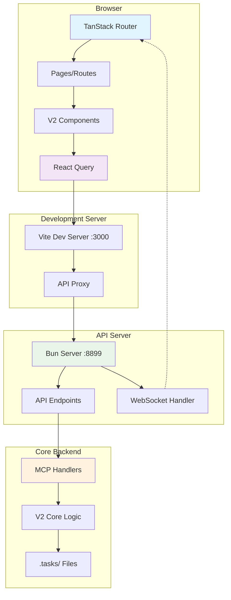

# Task UI 2.0 - V2 Architecture

A modern React application for managing Scopecraft V2 tasks with real-time data, URL-based filters, and beautiful V2 components.

## High-Level Architecture



## Technology Stack

### Frontend
- **TanStack Router** - File-based routing with type safety
- **React Query** - Server state management with caching and auto-refresh
- **Tailwind CSS** - Utility-first styling
- **Storybook** - Component development and documentation
- **Zod** - Runtime type validation for search params

### Backend
- **Bun Server** - High-performance API server
- **MCP Handlers** - Model Context Protocol integration
- **V2 Core** - Scopecraft V2 task management logic
- **WebSocket** - Real-time Claude integration support

## Key Features

- 🔄 **Auto-refresh**: 30-second refresh when window is visible
- 🔗 **URL Persistence**: Filters stored in URL search params
- ⚡ **Real-time Data**: Live integration with V2 MCP API
- 🎨 **Beautiful Components**: CLI-inspired design with proper icons
- 📊 **Type Safety**: End-to-end TypeScript with Zod validation
- 🛠️ **DevTools**: React Query devtools for debugging

## Project Structure

### Important Files

#### Frontend Core
- [`src/main.tsx`](src/main.tsx) - App entry point with React Query setup
- [`src/routes/tasks/index.tsx`](src/routes/tasks/index.tsx) - Main tasks page with search params
- [`src/lib/api/client.ts`](src/lib/api/client.ts) - Comprehensive API client
- [`src/lib/api/hooks.ts`](src/lib/api/hooks.ts) - React Query hooks for all endpoints

#### V2 Components
- [`src/components/v2/`](src/components/v2/) - All V2 components
- [`src/components/v2/TaskManagementView.tsx`](src/components/v2/TaskManagementView.tsx) - Main task list with filters
- [`src/components/v2/V2Showcase.stories.tsx`](src/components/v2/V2Showcase.stories.tsx) - Page templates
- [`src/components/v2/index.ts`](src/components/v2/index.ts) - Component exports

#### Backend
- [`server.ts`](server.ts) - Main API server with endpoint routing
- [`vite.config.js`](vite.config.js) - Vite configuration with proxy setup
- [`package.json`](package.json) - Dependencies and scripts

#### Configuration
- [`tailwind.config.js`](tailwind.config.js) - Tailwind styling configuration
- [`.storybook/`](.storybook/) - Storybook configuration

## API Architecture

### Endpoints
- `GET /api/tasks` - List all tasks (simple + parent) with filtering
- `GET /api/parents` - List parent tasks with progress info
- `GET /api/workflow/*` - Workflow operations
- `WebSocket /ws/claude` - Claude integration (preserved for future)

### Data Flow
1. **User Interaction** → Component state change
2. **Component** → React Query hook call
3. **React Query** → API client request
4. **API Client** → Fetch to `/api/*` endpoint
5. **Vite Proxy** → Forward to server :8899
6. **Server Router** → MCP handler call
7. **MCP Handler** → V2 core operations
8. **V2 Core** → File system operations

## Development Workflow

### Setup
```bash
# Start both API server and UI dev server
bun run ui2:dev

# Or separately:
bun run ui2:dev:api   # API server on :8899
bun run ui2:dev:ui    # Vite dev server on :3000

# Storybook for component development
bun run storybook
```

### URL Structure
- `/tasks` - Main task list with filters
- `/tasks?status=in_progress&workflow=current` - Filtered view
- `/parents` - Parent task management (future)

### Filter Persistence
All filters are stored in URL search params and are shareable:
- `search` - Text search query
- `status[]` - Task status filters
- `type[]` - Task type filters  
- `workflow[]` - Workflow state filters
- `area[]` - Area filters

## Current Status

### ✅ Completed (Phase 1 & 2)
- **Storybook Setup** - Component development environment
- **V2 Components** - Complete component library with CLI-inspired design
- **API Integration** - React Query with auto-refresh
- **URL Filters** - TanStack Router search params integration
- **Server Setup** - API server with MCP handler integration

### 🔄 In Progress (Phase 3)
- **Pages & Navigation** - Convert showcase views to actual pages
- **MCP Bug Fix** - `handleTaskList` not returning parent tasks (see bug report)

### 🔮 Future (Phase 4)
- **Drag & Drop** - Subtask reordering
- **Advanced Features** - Parallel task management, task conversion UI
- **Claude Integration** - WebSocket-based AI assistance

## Known Issues

1. **MCP Handler Bug**: `handleTaskList` with `task_type='top-level'` only returns simple tasks, not parent tasks. Bug report created: `mcp-hnd-not-rtr-par-tas-wit-05A`

## Architecture Decisions

### Why TanStack Router?
- File-based routing with excellent TypeScript support
- Built-in search params validation with Zod
- Loader pattern for data fetching (though we use React Query instead)

### Why React Query?
- Automatic caching and background refetching
- Optimistic updates for mutations
- Built-in loading and error states
- Perfect for real-time task management

### Why Bun Server?
- High-performance JavaScript runtime
- Seamless integration with existing MCP handlers
- WebSocket support for future Claude features
- Simple proxy setup for development

## Related Documentation

- [Storybook Components](http://localhost:6006) - Component library and showcase views
- [React Query DevTools](http://localhost:3000) - Available in development mode
- [V2 Task System Specification](../docs/specs/task-system-v2-specification.md)
- [MCP Handler Documentation](../src/mcp/README.md)