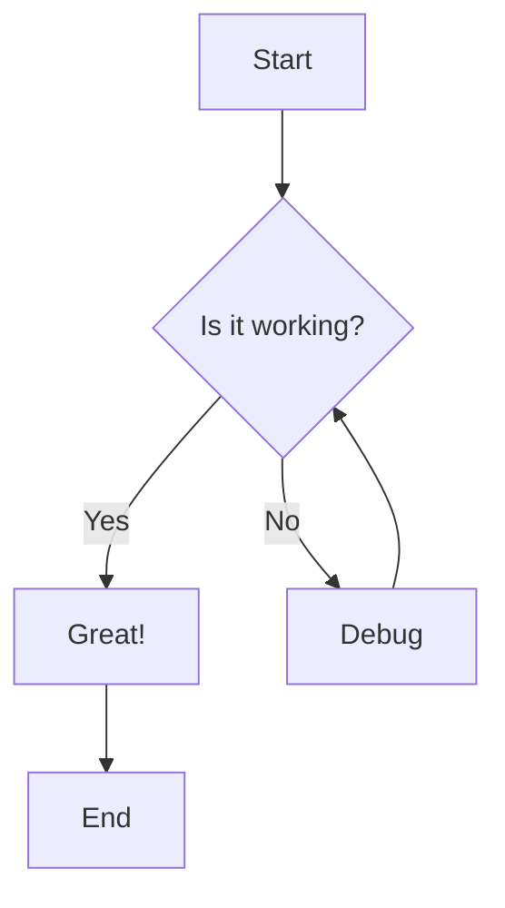
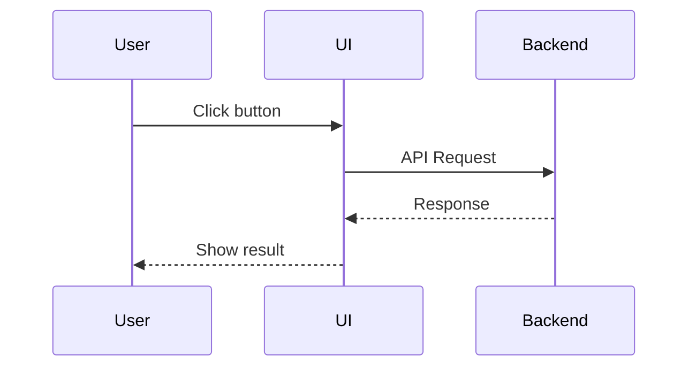
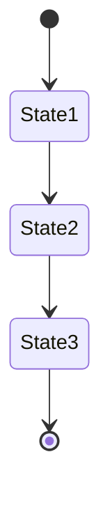
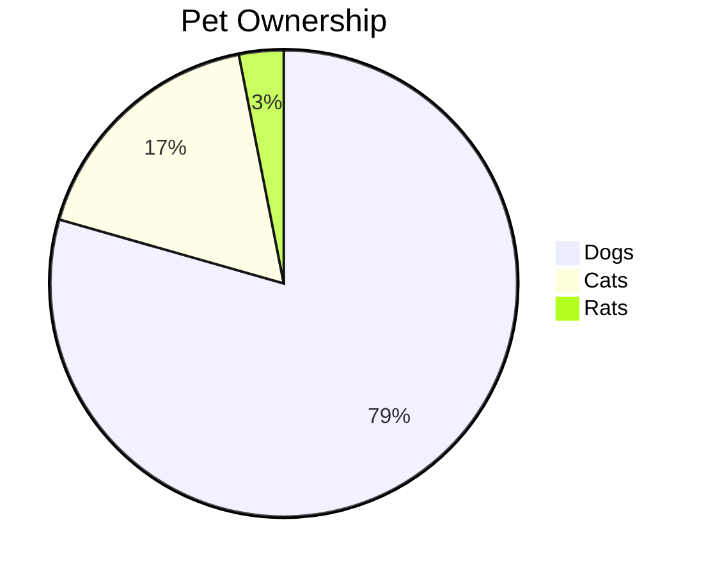

# Test Mermaid Diagrams

This task contains various Mermaid diagrams to test the rendering.

## Flowchart Test

## Sequence Diagram Test

## State Diagram Test

## Pie Chart Test

This task should properly render all these Mermaid diagrams with appropriate dark/light theme support.